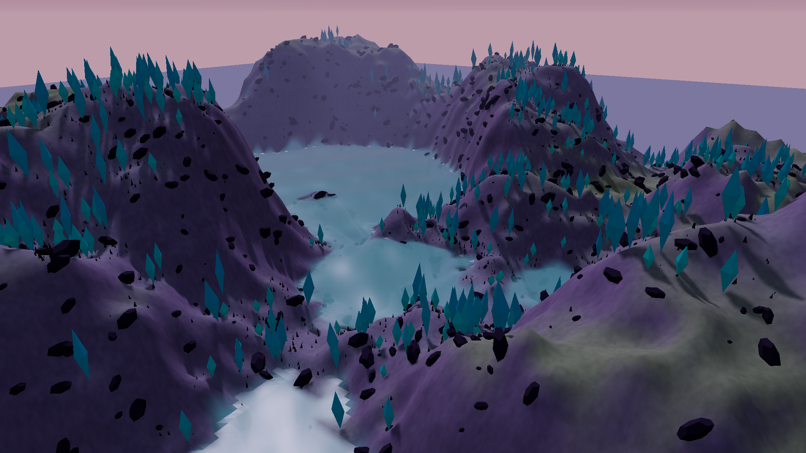

# Worldline

An original, locally trained spatial generator with a 3D explorer, learned ecosystem changes, persistent edits, and alternate futures.

**Research prototype. Genie 3 parity has not been established.** Worldline generates small terrain fields and learns synthetic water, vegetation and heat transitions. Three.js renders those fields. It is not a general-purpose neural video model, and it does not claim three new scientific breakthroughs.

The editor requires no inference API, hosted generative service, external foundation-model weights, or API key. Its original source, trained checkpoints, training data generator, evaluation code, and research review use Apache-2.0. Optional experiments have separate source, data and external-weight notices, as listed below.



The image shows the programmed 3D renderer displaying learned terrain fields. See the [measured results](docs/initial-results.md) for what the models and software have actually demonstrated.

## Run

Requirements: Python 3.11+, Node.js 20.19+ or 22.12+, and a browser with WebGL2. Tested development machine: Apple M4 Pro with 24 GB memory. Training selects MPS, CUDA, or CPU. The small shipped models use CPU inference by default because it was faster in the local benchmark; set WORLDLINE_DEVICE=mps or cuda to override. CPU speed varies.

On macOS, double-click **start.command** after cloning this repository. It installs the Python dependencies, builds the browser interface, and opens the editor in your browser. The initial dependency installation needs internet access. Keep its terminal window open while using the app.

Or run from this directory:

```sh
python3 -m venv .venv
source .venv/bin/activate
python -m pip install -e '.[test]'
npm --prefix web ci
npm --prefix web run build
python -m worldline.server
```

Open **http://127.0.0.1:8787**. Everything after installation runs locally. The server listens only on this computer. This prototype is not configured for public hosting.

## Explore and change a world

Choose an alpine, desert, or alien preset and generate a world. The same seed, model weights, settings and numerical environment reproduce its initial fields. The prompt parser recognizes a small documented keyword vocabulary; it is not a language model.

Use the camera controls to explore. Choose a brush to raise or lower terrain, add vegetation, add water, or apply heat. Change rain or heating and advance the ecosystem using the learned transition model. Save an alternate future before trying a different intervention, or restore a previous revision. Export a world to a portable JSON file and import it later.

Worlds and histories are saved automatically in `.worldline/worlds.sqlite`. That directory is excluded from Git. Restore creates another revision so the old history remains available. Branches start from the same saved state and then change independently.

## What is learned

| Component | Implementation | Scope |
| --- | --- | --- |
| Spatial generation | Original time/biome-conditioned rectified-flow U-Net, trained from scratch | Two 64 × 64 fields: height and vegetation density; three synthetic terrain categories |
| Environmental prediction | Original residual convolutional network | Water, vegetation and heat changes under rain/heating controls |
| Prompt interpretation | Explicit keyword parser | Selects one of three categories; other text does not change the model conditioning |
| Display | Three.js terrain, materials, lighting, water and foliage | Programmed 3D rendering, not newly generated neural video frames |
| Camera, editing, saving, branching | Ordinary software | Exact stored state and spatially restricted modifications |

Renderer FPS and neural generation time are different measurements. High display FPS does not demonstrate high neural video throughput. Exact saved-state persistence does not demonstrate emergent neural memory or realistic physics.

## Reproduce training and evaluation

The dataset generator is original project code. No game recordings, external imagery, or pretrained checkpoint is needed.

```sh
python -m worldline.train
python -m pytest -q
python tests/benchmark.py
```

The default training profile uses 1,600 flow optimization steps and 1,000 ecological-model steps. It writes model metadata and measured validation/test results in `checkpoints/`. Training time depends on hardware. Training again replaces checkpoint files, so copy them first if you want to retain an earlier experiment.

Read the [model card](docs/model-card.md) and [evaluation protocol](docs/evaluation-protocol.md) before interpreting the results. The reported learning tests concern synthetic fields. They are not FVD, human visual preference, WorldMark/WBench results or a comparison with Genie 3.

## Research and next experiments

The [September 7, 2026 research review](docs/research-2026-09-07.md) includes current systems, less-mainstream research, source and weight licensing, available training recipes, recent benchmarks and unresolved limitations. It records current releases such as Atlas, GWM Worlds 2, AlayaWorld v1.1 and LingBot-World Infinity, plus relevant new work on action effects, persistent computation and explicit state.

The three immediate engineering capabilities are:

1. Preserve generated fields and edits across camera movement, reloads and process restarts.
2. Confine a brush edit to selected cells, preserving all other saved values.
3. Branch from an identical saved world and compare learned consequences of different controls.

These have substantial prior art, documented in the review. Worldline implements and tests them; it does not claim to have invented them.

The [research plan](docs/research-plan.md) sets out what remains necessary for broad neural world generation, stronger graphics, meaningful novelty and a defensible frontier-model comparison.

The separate [original RGB experiment](docs/room-rgb-experiment.md) trains action-conditioned image models from scratch. A direct predictor performed better than a small diffusion model on the same room scenes, but both lose detail and fail to demonstrate reliable door memory. Source, small original checkpoints, measured errors and failure images are included. To try its actual neural predictions, double-click **start-room-lab.command**, or run `python -m experiments.room_world.play --open`. Room Lab opens at **http://127.0.0.1:8788** and uses CPU inference. Every action after initialization generates one 64 by 64 image; the larger canvas displays those pixels without added detail.

The [external neural baseline study](docs/neural-baseline-study.md) records actual local runs of DIAMOND and WorldFM, with pinned artifacts and reproduction scripts. Those external models are not used by the editor and their weights are not redistributed here.

The [512 × 288 video-adapter pilot](docs/wan-atrium-pilot.md) trains an original action and starting-image adapter through an attributed, frozen Wan2.1 base on the Mac. Ten real-data updates completed, but generated clips fail the door interaction and camera turn and contain strong texture artifacts. Both perform worse than repeating the starting image in the reported RGB comparison. Original adapter weights, complete failure videos, real training inputs and measurements are included. The [132-frame Atrium capture](experiments/atrium_data/README.md) provides original Blender training data with independently checked camera/action labels. The [foundation training audit](docs/foundation-training-audit.md) and [data source audit](docs/data-source-audit.md) explain available training recipes and license evidence.

The [terrain-data scaling proposal](docs/cloud-experiment.md) specifies a paired comparison of training dataset sizes, fresh evaluation data, acceptance thresholds and optional compute costs. That proposed experiment has not been run or scheduled.

## Project layout

```text
worldline/models.py     Original neural architectures and inference
worldline/data.py       Original synthetic training data and teacher
worldline/train.py      Training, checkpoint metadata, measured learning
worldline/state.py      Immutable snapshots, edits and independent branches
worldline/server.py     Local inference and persistence API
web/                   Interactive browser renderer and controls
checkpoints/           Original learned weights and training measurements
experiments/room_world/ Original RGB prediction experiment and weights
experiments/baselines/  Optional external-model measurement scripts
experiments/atrium_data/ Original higher-resolution capture and validation
experiments/wan_adapter/ Original adapter with an attributed frozen Wan core
tests/                 Correctness tests and local benchmark runner
docs/                  Research, model card, evaluation and limitations
```

## License and contributions

The editor, original neural architectures and their original synthetic-data-trained weights use [Apache-2.0](LICENSE). The separately licensed Atrium Blender scripts use [GPL-3.0-or-later](experiments/atrium_data/LICENSE); the original Atrium scene and generated data use [CC0-1.0](experiments/atrium_data/DATA-LICENSE). Its independent validator uses Apache-2.0. Optional pretrained-model experiments retain their [source and weight notices](experiments/wan_adapter/NOTICE). Dependencies retain their own licenses. Papers in the research review are references; their inclusion alone does not make them model dependencies. No association or endorsement by those authors is implied.

Contributions should include reproducible measurements, an explicit learned/programmed distinction and relevant prior art. A visual example alone is insufficient evidence of world-model accuracy or scientific novelty.
