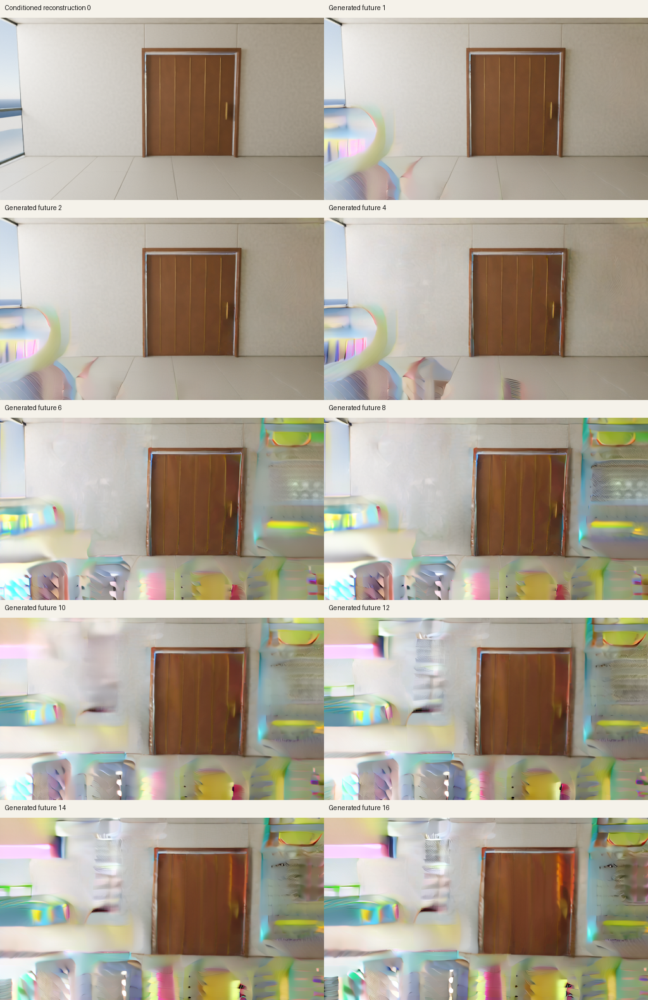

# Native CUDA diagnostic: execution passed, graphics failed

On September 7, 2026, one NVIDIA A100-SXM4-80GB completed the external pretrained Wan2.2 TI2V-5B initial prediction pair and a separate 17-frame, 512 × 288 clip. All 100 clip predictions and 50 CPU UniPC updates completed. **The generated future frames still develop severe colored, warped surfaces.** This failed visual result is not a usable world-model foundation or an original research advance.

The core used byte-exact upstream equations, original FP32 parameter storage, CUDA BF16 autocast and FlashAttention 2. The retained initial noise, image latent and genuine cached text are identical to the earlier Mac comparison. The solver used shift 5 and CFG 5. The first frame is conditioned; only the following 16 are generated futures.

| Measurement | Result |
| --- | ---: |
| Initial pair: loading and verification | 232.961 seconds |
| Initial pair: two predictions | 2.224 seconds |
| Initial pair: whole parent run | 243.186 seconds |
| Clip: core loading and verification | 221.542 seconds |
| Clip: 50 solver steps and 100 predictions | 198.348 seconds |
| Clip: whole parent run, including decode | 476.444 seconds |
| Native FP32 VAE load | 37.151 seconds |
| Native VAE decode, excluding its load | 1.128 seconds |

These measured intervals exclude the preceding container setup and checkpoint download. The preview requested 8 fps, but GIF stores 120 ms per frame, giving 8.33 fps playback. Neither figure measures model throughput. The [pair evidence](../experiments/wan22_native/cuda_reference/results/a100-pair-v1/README.md) preserves all 825 original FP32 weight checks, two partial prediction files, final velocities, raw inputs, source snapshots and resource samples. CUDA's future guided velocity differed from streamed official CPU by 2.294357% of that CPU reference's RMS. The independent audit recomputed all 39 numerical comparison rows exactly. No equivalence threshold was assigned.

The [clip evidence](../experiments/wan22_native/cuda_reference/results/a100-clip50-v1/README.md) preserves every saved latent step, raw decoded RGB, all 17 original PNGs and the preview. The conditioned room starts sharp. Silvery and brightly colored shapes appear in the first future frame, spread across the floor and right wall, and occupy large regions in later frames. The door remains recognizable, while surrounding geometry becomes distorted.

This reproduces the same category of failure seen on the Mac. It shows that Mac-specific execution is not necessary for this particular failure. It does not establish a cause or pixel-level agreement. Shared reduced dimensions, cached observation/text preparation and other common inputs remain possible contributors. A separately prepared spatial-size control is proposed in the clip evidence; it has not run. Broad quality, action learning, persistent world memory and Genie 3 parity remain unproven.

## Setup and recovered records

The container was the official PyTorch image pinned to digest `14611869895df612b7b07227d5925f30ec3cd6673bad58ce3d84ed107950e014`. Runtime checks reported Python 3.11.10, Torch 2.5.1+cu124, CUDA toolkit 12.4, FlashAttention 2.7.4.post1 and NVIDIA driver 580.126.16. The first setup check failed because SSH's command path omitted the installed CUDA compiler. A new setup directory with explicit CUDA and Conda path entries passed; both outcomes and the exact setup sources are retained.

All six pinned checkpoint/config hashes matched before model execution. No text-encoder checkpoint was downloaded. The pair archive was 8,726,062 bytes; the clip archive was 66,228,413 bytes. Both local archive hashes matched their remote hashes before extraction. All 87 pair/setup files and all 146 clip recovery files are retained in the linked evidence. External model weights remain outside the repository.

## Rental closure

The single Secure Cloud instance reported $1.59 per compute hour, 100 GB temporary container disk, zero persistent volume and no network volume. An external controller on the Mac watched a one-hour deadline. Normal completion requested early deletion after both result archives were recovered.

The creation request began at 22:07:44 UTC. DELETE was acknowledged at 22:31:49 UTC. The exact-ID GET then returned HTTP 404, and a successful complete Pod list was empty at 22:31:50 UTC, about 24 minutes 6 seconds after the request. The temporary account key was subsequently revoked; a read with that key returned HTTP 401. Local API and SSH private-key files were removed.

The [redacted lifecycle records](cloud-gpu-diagnostic-evidence/completed-v1/lifecycle.jsonl), [cleanup result](cloud-gpu-diagnostic-evidence/completed-v1/cleanup-result.json) and [summary](cloud-gpu-diagnostic-evidence/completed-v1/summary.json) retain the completion evidence. The private Pod identifier is replaced with a stable alias; [provenance](cloud-gpu-diagnostic-evidence/completed-v1/provenance.json) records original and public hashes. No account identity, balance, credential, connection address or complete provider inspection response is published. The rate and elapsed interval are not an itemized provider invoice.
