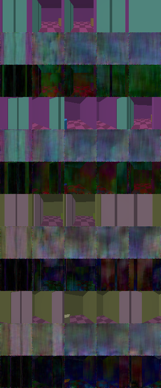
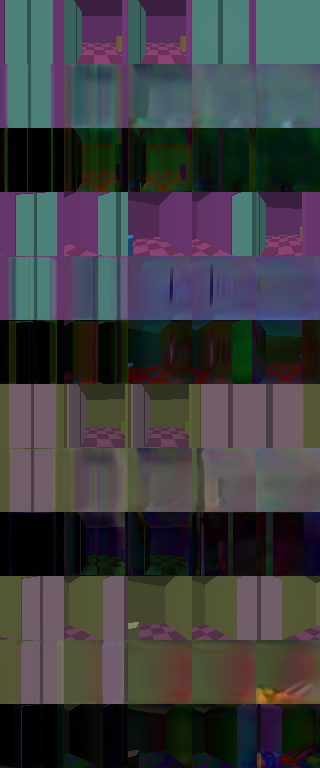
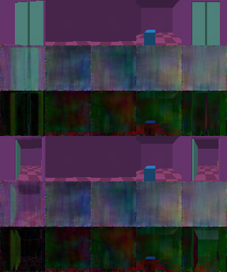
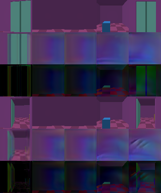

# Original RGB room-world pilot

September 7, 2026. Two original image models were trained from scratch on this Mac. The direct predictor performed better than the flow generator in this small pilot. Both produced visible errors and lost detail during rollouts. Neither demonstrated reliable long-term door memory, convincing general world graphics, scientific novelty or Genie 3 parity.

This experiment is separate from the released terrain editor. Its neural rollout predicts RGB pixels directly from previous RGB frames and actions. The original room renderer supplies training images, initial observations and evaluation truth. After initialization, the rollout function receives no renderer output, camera pose, geometry, collision result or door-state label.

## Published artifacts

| Model | Inference weights | Results | Provenance |
| --- | --- | --- | --- |
| Conditional rectified flow | [model.pt](../experiments/room_world/artifacts/flow/model.pt) | [metrics](../experiments/room_world/artifacts/flow/metrics.json), [dataset manifest](../experiments/room_world/artifacts/flow/dataset-manifest.json), [memory diagnostic](../experiments/room_world/artifacts/flow/aliasing-metrics.json) | [hashes and tensor verification](../experiments/room_world/artifacts/flow/provenance.json) |
| Direct RGB predictor | [model.pt](../experiments/room_world/artifacts/predictor/model.pt) | [metrics](../experiments/room_world/artifacts/predictor/metrics.json), [dataset manifest](../experiments/room_world/artifacts/predictor/dataset-manifest.json), [memory diagnostic](../experiments/room_world/artifacts/predictor/aliasing-metrics.json) | [hashes and tensor verification](../experiments/room_world/artifacts/predictor/provenance.json) |

Each publication checkpoint contains inference tensors and configuration. Its local output-directory field was removed. Every tensor was compared with its raw training checkpoint using exact shape, dtype and value equality. Provenance records both checkpoint hashes and each tensor's hash. The raw local runs, optimizer states and large frame arrays remain unchanged in an ignored directory. They are not included in the publication artifacts.

The [experiment README](../experiments/room_world/README.md) contains runnable training, evaluation and reproduction instructions. Original code, generated data and these original weights use the repository's Apache-2.0 license. There are no external visual assets, pretrained weights or inference APIs in this experiment.

## Data and selection protocol

The original NumPy renderer traces rays through two connected rooms, a hinged door and colored box objects. Scene seeds vary dimensions, colors and object geometry. Actions are wait, forward, backward, left turn, right turn and interact. An interaction can change the door's persistent teacher state when the camera is close enough and facing it. These programmed rules generate training and evaluation truth; the neural rollout does not call them.

Images are 64 by 64 RGB pixels. Each episode begins with four copies of its initial observation, followed by 32 action transitions. Scripted approach/open/turn sequences and seeded random controls provide the trajectories. Some scripts are shared between splits. This evaluates new scenes inside this generator's distribution, not unseen action policies or real environments.

| Split | Scene seeds | Scenes | Episodes | Target transitions |
| --- | --- | ---: | ---: | ---: |
| Training | 1000 through 1015 | 16 | 32 | 1,024 |
| Validation | 100000 through 100003 | 4 | 8 | 256 |
| Test | 200000 through 200003 | 4 | 8 | 256 |

Both arms used initialization seed 71991 and exactly equal dataset manifests, including every trajectory content hash. Scene ranges and episode seeds are disjoint across splits. The second run included a numerical clamp for fog values on rays that miss a box; those values cannot contribute visible pixels. Exact manifest equality verifies that the captured images and controls were unchanged between arms.

Both models used width 24, batch size 16, AdamW with learning rate 0.0003 and weight decay 0.0001, gradient clipping at 1.0, and 1,200 optimization steps. Training histories received Gaussian noise with standard deviation 0.02 after normalization to [-1,1]. Targets remained clean. EMA used 0.99 retention of the previous averaged weights.

The flow network has 499,371 parameters and predicts the standard rectified-flow velocity from a noised next image, four context images, time and action. Inference uses eight Euler steps. The direct predictor has 498,651 parameters and predicts an RGB residual added to the previous image, with output clamped to [-1,1]. Its loss is RGB L1 plus 0.1 times horizontal and vertical image-gradient L1 losses.

Checkpoint selection used a fixed batch of 64 sampled validation transitions, with fixed noise/time values for the flow objective. Validation was checked every 100 steps and at the end. Both selected step 1,200. The flow objective decreased from 1.207381 to 0.048527. The predictor objective decreased from 0.050820 to 0.031493. These losses have different definitions and cannot be compared against each other as quality scores.

The protected test scenes were evaluated after checkpoint selection. Their results did not select those checkpoints. Both arms were specified before their test evaluations. The comparison below is descriptive evidence from one initialization seed. Because these results and images have now been inspected and used to choose the next development direction, these scene seeds must be treated as development evidence for future experiments.

## Measured prediction results

MAE is measured on RGB values in [0,1]; lower is better. The one-step evaluation scores all 256 test transitions using real context images. Moving pixels are those where any target channel differs from the previous image by more than 0.04 in normalized [-1,1] units. This mask is used only for evaluation. The repeat-last baseline copies the last observed image. The zero-action ablation replaces actions with wait and uses the same sampled noise as the corresponding flow prediction.

| Test measurement | Flow | Predictor | Repeat last image |
| --- | ---: | ---: | ---: |
| One-step full-image MAE | 0.03982 | 0.01943 | 0.03215 |
| One-step moving-pixel MAE | 0.07216 | 0.05783 | 0.12042 |
| One-step moving-pixel MAE with zero actions | 0.10553 | 0.11862 | 0.12042 |
| Autoregressive MAE at step 4 | 0.08119 | 0.06161 | 0.10111 |
| Autoregressive MAE at step 16 | 0.08679 | 0.07862 | 0.11295 |
| Autoregressive MAE at step 20 | 0.09650 | 0.08072 | 0.08344 |
| Autoregressive MAE at step 32 | 0.10839 | 0.08309 | 0.08953 |

The autoregressive evaluation starts from four initial observations, then uses generated images for every later context. It scores all eight test episodes. The persistence baseline keeps the starting image for the entire rollout. Both models benefit from correct actions on moving-pixel error. The predictor improves the recorded full-image and moving-pixel results more than the flow model. Its advantage over persistence is small by step 32. The flow model is worse than persistence on full-image one-step error and at steps 20 and 32.

These scores do not establish convincing image quality. The following sheets contain the first four test episodes, with no example selection. Each episode occupies three rows: true image, predicted image and absolute pixel difference. Columns are steps 1, 4, 16, 20 and 32. Flow predictions are visibly noisy and blurred. The direct predictor initially preserves more detail but develops blur and distorted geometry.

## Door memory and 64-step behavior

The independent diagnostic uses one explicit pair in scene 200000, with trajectory seed 20260907. A valid interaction opens one copy's door while the other remains closed. Both cameras turn 180 degrees, wait, then return: 24 left turns, 16 waits and 24 right turns.

In the uninterrupted test, each model starts from four copies of the corresponding visible initial image. It generates all 64 subsequent images from its own history. The endpoint from the initially open case is closer in pixel distance to the closed-door truth for both models:

| Initially open case, step 64 | Error to its open-door truth | Error to the other closed-door truth |
| --- | ---: | ---: |
| Flow | 0.09816 | 0.07916 |
| Predictor | 0.11806 | 0.10058 |

This comparison is a pixel proxy on one pair, not a semantic door-state classifier or a population success rate. Camera errors and blur also affect it. The observed behavior does not demonstrate reliable door memory.

The uninterrupted sheets use columns 1, 24, 40, 52 and 64. Rows are closed-case truth/prediction/error followed by open-case truth/prediction/error.

A separate structural test begins after the 40 away/wait steps. The last four true images are byte-identical in the open and closed cases, and the future return actions are identical. Their true images diverge again at return step 17. Both models produce exactly identical paired predictions when given those equal histories and equal sampling noise. No model restricted to these inputs can determine which earlier door state actually occurred. A stochastic model could represent both possible futures, but these inputs cannot identify this episode's hidden state. This information limit is separate from the observed errors of the uninterrupted model rollouts.

## Runtime and limits

Hardware was the local Apple M4 Pro with 24 GB memory, using PyTorch MPS. Recorded versions were Python 3.11.9, PyTorch 2.5.1 and NumPy 2.4.2.

| Measured time | Flow | Predictor |
| --- | ---: | ---: |
| Dataset creation | 13.21 seconds | 14.09 seconds |
| Optimization and validation | 186.94 seconds | 178.12 seconds |
| Main held-out evaluation | 45.68 seconds | 6.90 seconds |
| Mean time per generated frame across evaluated episodes | 81.86 milliseconds | 10.56 milliseconds |

The 600-second optimization caps were not reached. Data creation and evaluation time are separate from that cap. Per-frame measurements include transfer and generated-history updates and some first-call overhead. They are means from these episodes, not p95 latency, a stable interactive frame rate, or browser rendering FPS. The additional memory diagnostic took approximately 14.1 seconds for flow and 3.3 seconds for the predictor in the recorded invocation.

Fourteen focused and independent tests passed, including action/frame alignment, recursive generated-frame feedback, safe checkpoint loading, split separation, persistence baselines, common noise and the door ambiguity case. Passing software tests does not establish realistic physics or image quality.

The pilot has only four test scenes, eight episodes, one initialization seed per arm and one noise sample per evaluated flow episode. There are no confidence intervals, human preference scores, real-image tests or matched frontier-model comparisons. Pixel averages can reward blur and static backgrounds. The data rules and action patterns are narrow, and the models cannot be assumed to generalize outside them. The preferred next development baseline is the direct predictor; the flow result remains published as part of the comparison.

## Smallest next memory experiment, not implemented

Add a learned 32-value recurrent state to the direct predictor. Pool its existing 96-channel bottleneck to a vector, concatenate the existing 64-value action embedding, and update a 32-unit GRU once per world step. A linear layer maps that state to scale and shift values for the 96 bottleneck channels. This adds 24,960 parameters by the proposed dimensions, plus 128 bytes of float32 recurrent state. Actual counts and memory use must be verified after implementation.

Initialize the state to zero on a new episode. Update and carry it using RGB and actions only. It must not receive the teacher's door state, camera pose or geometry. Begin with the published predictor weights frozen and train only the GRU and conditioning layer. This isolates the small memory addition; it may be insufficient to fix the baseline's image drift.

Use new training scenes 5000 through 5031, new validation scenes 300000 through 300007, and reserve test scenes 400000 through 400031 without generating or inspecting them until the protocol is frozen. Existing scenes 200000 through 200003 are now development data. Build paired episodes from the same closed-door observation: an initial valid interact versus wait, followed by the shared 64-step excursion. The 65-step sequences provide an observed cause for the later difference. Include unsuccessful interactions and vary waiting duration in a separately reported control set.

Compare a carried-state arm with a parameter-matched arm that resets the GRU state every step, using the same source predictor, sequences, optimizer budget and three initialization seeds. Start with batch two and backpropagation through the full 65-step sequence so the return loss can reach the earlier interaction. Profile 50 steps on MPS before committing to 1,200 updates and a 600-second cap per run. Reducing the sequence length below the occlusion interval would change the memory question and must be reported. Keep the direct predictor as a third reference with no new training.

Score two distinct protocols: memory accumulated from observed training-style prefixes followed by the aliased return, and uninterrupted 65-step generated-history rollouts. The former tests whether the learned state stores useful information; only the latter measures its behavior when image errors also accumulate. Evaluate return pixels where the paired true futures differ, and count a pair as correct only if both predictions are closer to their own true return than to the opposite return. Count ties as failures.

Provisional engineering gates are at least 30% lower paired return-region MAE than the reset-state arm, at least 80% correct pairs, and no more than 5% worse one-step MAE on the separate control set. Require the direction of the memory improvement to agree across all three seeds. Report uncertainty by resampling whole scenes. Freeze thresholds and selection rules before opening the reserved test set. If improvement appears only with observed prefixes, report a memory-storage result without claiming successful uninterrupted world simulation.

This proposal has not been implemented or trained. Learned recurrent state, action-conditioned image prediction and diffusion objectives all have substantial prior art, including [World Models](https://arxiv.org/abs/1803.10122), [DIAMOND](https://arxiv.org/abs/2405.12399), [GameNGen](https://arxiv.org/abs/2408.14837) and [rectified flow](https://arxiv.org/abs/2209.03003). Success would establish a specific measured improvement in this project, not a new scientific method or frontier-model parity.
