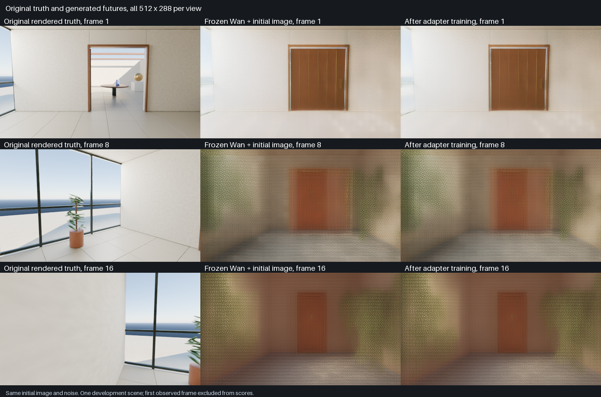

# Original action adapter on a frozen Wan video model

Measured September 7, 2026. Worldline trained an original 1,349,376-parameter action and starting-image adapter through the frozen, externally pretrained Wan2.1-T2V-1.3B model on the 24 GB M4 Pro. Ten updates used real original 512 × 288 rendered windows and genuine VAE/text encodings. The run completed in 159.33 seconds with unchanged base weights and finite adapter gradients.

This is a single-scene development experiment. The fixed denoising error improves, but the action-shuffling control barely changes that error. Useful action control, generalization, persistent memory, real-time generation and Genie 3 parity remain unestablished. The original adapter is a trained model component; the 1,418,996,800-parameter Wan foundation belongs to its upstream authors. No hosted generation API is used.

## Reproducible inputs

The [original Atrium capture](../experiments/atrium_data/README.md) contains 132 native RGB/depth observations in two branches of one architectural layout. One branch opens a door; both turn away, wait and return. The camera has a fixed position. Indirect light reveals door state while it is offscreen, so the pair does not isolate hidden-state memory. Independent geometric checks verified the camera convention and axial depth.

The [released development cache](../experiments/wan_adapter/data_cache/README.md) contains eight 17-frame windows, starting at frames 0, 8, 32 and 49 in both branches. Their frames overlap and they share geometry. All eight belong to development. Native RGB values are converted to [-1,1] without resizing and encoded independently by the official Wan VAE. Eleven actual future-perturbation, first-frame and inter-clip cache checks passed with maximum difference zero. The starting observation is encoded alone; later clean images are training targets only.

The [VAE reconstruction test](../experiments/wan_adapter/codec/README.md) reports 32.50 dB whole-clip PSNR and mean frame SSIM 0.9708 on a 17-frame clip. Large surfaces and the door survive, while thin leaves and window details smear. These scores include large, nearly uniform wall regions. The first full-precision attempt stopped at its memory threshold; the successful float16 run cleared unused allocator buffers between stages. Reconstruction quality measures this external codec, not generated world-model behavior.

The [genuine UMT5 cache](../experiments/wan_adapter/text_cache/README.md) contains the actual empty-string context and one shared Atrium prompt. The 25-token positive prompt is identical for both branches. Its encoder ran with block-by-block float32 evaluation of the official BF16 weights, avoiding measured intermediate values too large for float16. The small cached outputs are included; the large external encoder weights remain separate.

## Model and training

The original adapter injects ordered commands and 32 pooled starting-image tokens at three transformer blocks. Four consecutive six-channel commands are concatenated without reordering or averaging. Translation and pitch channels are reserved but have no examples in this capture. The current image tokens contain no explicit spatial positions; a numerical test confirms that permuting those token vectors leaves their attention output effectively unchanged. They supply visual content without a direct record of which pooled cell occupied which position. Action adapters and observation conditioning have substantial prior art. This implementation is not a claimed new scientific method.

The frozen Wan base loads from a pinned, hash-verified official Apache-2.0 checkpoint. Its selected minWM implementation and MPS compatibility changes are attributed in the [runtime experiment](../experiments/wan_adapter/README.md). Initial adapter output projections are zero, and actual full-core equivalence with the base was checked before training. Base parameters receive no gradients and their final hash matches the initial hash.

Training uses batch one, AdamW at 0.0001, gradient clipping at norm 1 and seed 20260907. The eight windows run in a fixed balanced order, followed by the two initial windows again. Each update draws sigma uniformly from [0.05,0.95], mixes the clean target with Gaussian noise, and predicts `noise - target`. Loss is mean squared error over the four future latent frames. The first latent is replaced with the independently encoded observation and excluded from loss. The same declared starting-frame constraint is required during sampling.

The median update took 12.21 seconds. Sampled peak Metal driver allocation was 5.56 GiB. Driver allocation, live tensors and process RSS overlap and must not be added. The run used 900-second, 18-GiB and minimum-2-GiB-available safeguards. Earlier [synthetic runtime measurements](../experiments/wan_adapter/results/mps-runtime.json) were a separate experiment and are not substitutes for these real-data results.

## Fixed development comparison

This comparison uses the same open-branch starting window, sigma 0.5 and fixed noise before and after training. Values measure latent flow prediction, not RGB error or semantic task success.

| Condition | Future latent MSE |
|---|---:|
| Untrained adapter and frozen base | 0.11190675 |
| After ten adapter updates | 0.09817050 |
| Trained adapter, shuffled action order | 0.09821542 |
| Trained adapter, zeroed observation-token input | 0.10269046 |

The fixed error decreases by 12.27%. Shuffling actions raises the trained error by only 0.046%, which provides little evidence of learned action dependence here. Zeroing the adapter's observed-image input raises error by 4.60%, while the starting latent remains clamped in that control. That is a narrower ablation than removing all image conditioning.

The example was used in training and there is one layout. These values do not measure an unseen-scene improvement. The complete learning path, input integrity and finite updates are established; broader quality and control need independently designed scenes and generated-trajectory evaluation.

## The generated videos fail the task

The matched sampler receives the first observed latent, 16 planned commands, real text context and seeded noise. It never materializes the future target tensors. Both clips use seed 20260908, 20 Euler steps, shift 5 and classifier-free guidance 5. The first latent is clamped before each denoising call and after each solver update. Thus each decoded clip contains one reconstruction of the observed start and **16 newly generated future frames**.

Both videos retain a closed-looking door, fail to follow the commanded left turn and develop strong repetitive lattice textures. The trained video looks much like the base. The tested pipeline adds image-prefix clamping and 20-step Euler sampling to a T2V foundation; these results describe that particular adaptation.

A separate evaluator reads the original future images only after generation finishes. It cannot change the sampled frames. Its [complete RGB measurements](../experiments/wan_adapter/real_results/rgb-evaluation/metrics.json) exclude the known starting observation:

| Prediction | Future RGB MAE | Moving-region MAE |
|---|---:|---:|
| Frozen base with initial-image clamp | 0.33254 | 0.30632 |
| After ten adapter updates | 0.32401 | 0.29951 |
| Repeat the original starting RGB | 0.19022 | 0.22203 |
| Repeat its VAE reconstruction | 0.19115 | 0.22293 |

Both neural outputs have substantially higher pixel error than repeating the starting image. Moving regions use an original-frame change threshold of 0.02 in mean RGB difference and cover 51.22% of scored pixels. These metrics concern alignment with one inspected trajectory; the visual failure is also apparent in the retained frames. The lower training-space error did not produce useful controlled generation.

Base denoising took 211.27 seconds and decoding 27.80 seconds. The trained version took 209.03 and 27.22 seconds respectively. The combined measured interval was 489.80 seconds, with sampled peak driver allocation of 12.18 GiB. The trained clip therefore produced about 0.068 future frames per second when counting denoising and decoding, excluding model loading and file output. Its preview playback rate is independent of generation speed. This is offline generation of an action-planned clip, not interactive streaming.

The [training evidence](../experiments/wan_adapter/real_results/train10/metrics.json) includes both original adapter checkpoints and source snapshots. The [sampling evidence](../experiments/wan_adapter/real_results/sample20/metrics.json) retains all frames and the matched settings.

## Diagnosing the failed generation

[Decoding the same saved base latents in float32](../experiments/wan_adapter/codec/results/generated-base-fp32/README.md) retained the lattice pattern and blur. Future-frame MAE versus the original rounded float16 decode was 0.00105, with mean frame SSIM 0.99907 over all 17 frames. The successful decode took 27.79 seconds and reached a sampled peak Metal allocation of 10.35 GiB. The first attempt exceeded the available-memory threshold; a validated allocator cleanup hook let the retry finish without changing the decoder's mathematical operations or temporal state. Both attempts and the hook comparison are preserved. Decoder precision does not explain the visible failure of this clip.

A [source audit of native Wan sampling](wan-native-sampler-audit.md) identified several differences that remain confounded in the failed experiment. Wan's model-specific recommendation uses 50-step UniPC sampling, guidance 6 and shift 8–12. Native T2V starts every latent from noise and substitutes a configured negative prompt for an empty negative input. Its transformer also preserves float32 time, normalization, modulation and output operations within mixed-precision evaluation. The current experiment uses 20-step Euler sampling, guidance 5, shift 5, a real empty-string embedding, an all-float16 extracted core and a clamped initial latent. Its 512 × 288, 17-frame shape is structurally valid but smaller and shorter than the listed native example.

These differences prevent the failed videos from establishing native Wan's quality. A numerically checked pure-T2V control with the official scheduler is the next bounded diagnostic. That control would test the external foundation's generation path; it would not establish an original action-conditioned world model. A larger training dataset is premature until this path is checked.

## Source and evidence

The fixed [experiment protocol](../experiments/wan_adapter/PROTOCOL.md) defines action units, time alignment, VAE causality checks, image conditioning and claim limits. [Capture cache files](../experiments/wan_adapter/data_cache/manifest.json) contain source-image, tensor and implementation hashes. The [training](../experiments/wan_adapter/train_clip.py) and [sampling](../experiments/wan_adapter/sample_clip.py) entry points live beside the original adapter. Their guards reject missing or changed inputs, non-finite values and output directories containing earlier evidence.

Original adapter and training code use Apache-2.0. Original Atrium data and its identified derived cache use CC0-1.0. Separate Blender API scripts use GPL-3.0-or-later. The externally pretrained Wan/UMT5 models retain their own documented Apache-2.0 licenses and attribution.
