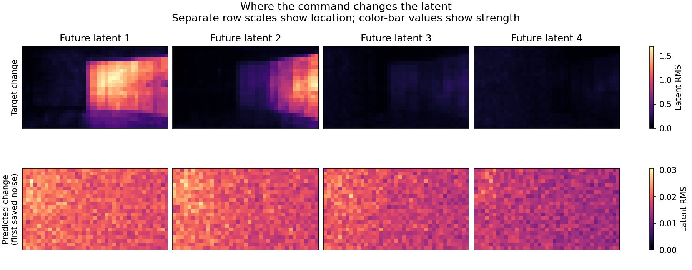

# Why stronger command amplitude is insufficient in the saved first step

September 8, 2026. This is a post hoc analysis of the already published single-room action-effect experiment. No model predictions or training were rerun. It does not establish a new method, a new test-set result, or successful control.

The analysis checks 50 consumed files against the public assessment index and reproduces all 12 recorded normalized errors. It then fits the best scalar to each predicted command difference using the correct answer. That target-fitted scalar is an optimistic diagnostic, not a usable inference setting.

| Measurement on the four new128 noise cases | Result |
| --- | --- |
| Best scalar multiplier of the existing CFG5 response | 1.902–1.977 |
| Target squared energy explained by that ideal multiplier | 0.638–0.696% |
| Residual error after independently fitting positive and negative command responses | 91.93–91.97% of target squared energy |
| Target energy that varies across spatial patches | 87.66% |
| Cosine after subtracting each frame's spatial patch mean | −0.000694 to 0.002396 |
| Target energy in its highest-energy 10.02% of patches | 78.60% |
| Model response energy in those same patches | 10.48–10.75% |

The response is poorly aligned with the target. Simply amplifying its saved direction cannot recover the door change in this first-step diagnostic. Removing the position-varying response slightly improves the measured error in all four cases, so the small reported numerical benefit comes from spatial mean components. The position-varying component itself increases error.

The positive/negative fit is more permissive than the original CFG5 rule and uses the target. Its two fitted coefficients are approximately 11.6–12.1, both positive, compared with the experiment's nominal clean-contrast coefficients 5 and −4. This is not a proposed sampler. Changing a real sampler would change later latent states and predictions; the initial-step fit cannot bound that nonlinear trajectory.

The spatial analysis uses 2 × 2 codec latent patches. It has no independent door segmentation. The top-energy mask comes from the target, and the measurements do not prove that the architecture is incapable of learning. They do justify testing command placement and independently varied camera data before another amplitude-only experiment.



## Reproduce

First download and verify the [complete public assessment](https://github.com/RaaghavC/open-worldline/releases/tag/wan22-action-effect-assessment-a100-v1), following its downloader instructions. With NumPy and safetensors installed, run from the repository root:

```sh
python experiments/action_effect_diagnostics/analyze.py \
  --download /path/to/verified-assessment-download \
  --output /path/to/new-diagnostic-output
python -m pytest -q experiments/action_effect_diagnostics/test_analyze.py
```

The script requires the exact public index hash, verifies each consumed file before loading, preserves the original FP32 CFG operation order, and scores in FP64. It creates a JSON report and latent-patch RMS arrays. It accepts no model weights and imports no Torch module.

The [complete result](results/direction-v2/report.json) records target use, consumed hashes and all cases, including zero and old128 controls. Four analytic tests cover scale versus direction, patch layout, spatial decomposition, and the independent two-branch fit. The [independent review](results/direction-v2/direction-independent-review.json) compares the scalar and branch results with a separately written implementation. Its source hash refers to the analyzed script before that review file was added.

The latest rendered control still failed. Genie 3 parity and three scientific breakthroughs remain unmet.
