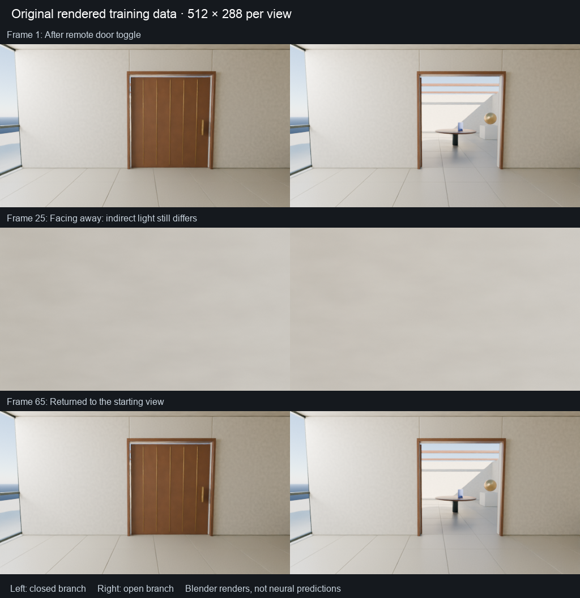

# Original Atrium capture

This experiment creates original 512 × 288 RGB, depth, normal and object-ID sequences for testing a video-model data pipeline. Blender renders the images from programmed geometry, materials, lights and actions. These images are training data, not neural model predictions.

The completed September 7, 2026 capture contains two 66-frame branches of one fixed architectural layout. Both start at a closed door. The open branch toggles it on the first transition; the closed branch waits. Both cameras then turn left 24 times, wait 16 times and turn right 24 times. Each turn is 7.5 degrees. The camera position stays fixed. The toggle is remote and instantaneous, with no reach, contact or collision simulation. Different seeds change the accent color and plant leaves, not the architecture.

The 132 frames supply 130 adjacent RGB transitions. They are suitable for codec, label-alignment and training-pipeline checks. They are not an independent scene split or evidence of broad world-model learning. Opening the door changes indirect illumination even in views with no visible door pixels. Consequently, these branches do not isolate memory through identical recent images.



The [complete paired preview](results/paired-render.mp4) plays every captured frame at 12 frames per second. Playback rate does not measure rendering or neural inference speed. The left branch leaves the door closed; the right branch opens it.

## Generate a capture

Tested with Blender 5.1.2 and its Cycles Metal renderer on an M4 Pro with 24 GB memory. The script starts a separate background process with factory settings. Its output directory must be empty or new. Run from the repository root:

```sh
blender --background --factory-startup --python-exit-code 1 \
  --python experiments/atrium_data/render.py -- \
  --output work/atrium-capture --samples 32 \
  --frames $(python3 -c 'print(*range(66))') --arms closed open
```

Use `--device CPU` when Metal is unavailable. Other GPU backends are not implemented. Omitting `--frames` captures only six selected frames per branch, which is an inspection preview, not a dense training sequence. `--max-seconds` is checked between frames; it does not interrupt a render already in progress. `--python-exit-code 1` makes script failures produce a nonzero Blender exit status.

On this Mac, the first cold single-frame run took 201 seconds. A subsequent complete capture took 199.61 seconds for 132 frames, with a median render-and-save time of 1.49 seconds per frame after shader compilation. These are programmed-renderer timings, not neural generation speed. The capture uses 22.21 MB of PNG images, 675.82 MB of multilayer EXR files and a 0.28 MB original scene file. Timings and byte counts are decimal unless otherwise stated.

## Validate the actual files

```sh
python3 -m pip install -e '.[test,atrium]'
python3 -m experiments.atrium_data.validate work/atrium-capture --require-dense
```

The validator checks hashes, image sizes, action-before-observation alignment, camera matrices, paired states and native EXR passes. [VALIDATION.md](VALIDATION.md) records the completed independent geometric checks and the illumination difference between branches. The optional [query_rays.py](query_rays.py) opens the generated scene in a separate background Blender process and casts geometric rays without rendering. Its command-line help describes how to supply selected frames and an output JSON file.

Each manifest entry contains `action_from_previous`: action at transition `t-1 → t` belongs to observation `t`. Frame zero has no incoming action. `world_from_camera` uses OpenCV camera axes (x right, y down, z forward), a world with z up and distances in meters. The current camera uses an 18 mm lens and a 36 mm horizontal sensor, giving focal lengths of 256 pixels at 512 × 288. RGB PNG files use AgX display rendering. EXR color values are scene-linear.

**Depth is axial camera-z in meters, not Euclidean distance along a viewing ray.** This was measured against independent off-axis scene raycasts in Blender 5.1.2. Native shading normals may be nonunit after filtering. Depth, object IDs and exact scene state are available for validation; an RGB-plus-action model must not silently receive these extra signals or call the renderer during prediction.

Blender 5.1.2 writes five EXR parts. Readers must inspect every part to find depth, normals and object IDs. Reading only the first part returns combined color and loses the other passes.

## License

The original Blender API scripts [render.py](render.py) and [query_rays.py](query_rays.py) use [GPL-3.0-or-later](LICENSE). The separately authored scene geometry, procedural materials, images and metadata generated by this experiment are dedicated under [CC0-1.0](DATA-LICENSE). No external scene assets, photographs or model weights are used to create them. The independent validator uses the repository's Apache-2.0 license and does not import Blender. These license grants do not cover unrelated external assets or models.
