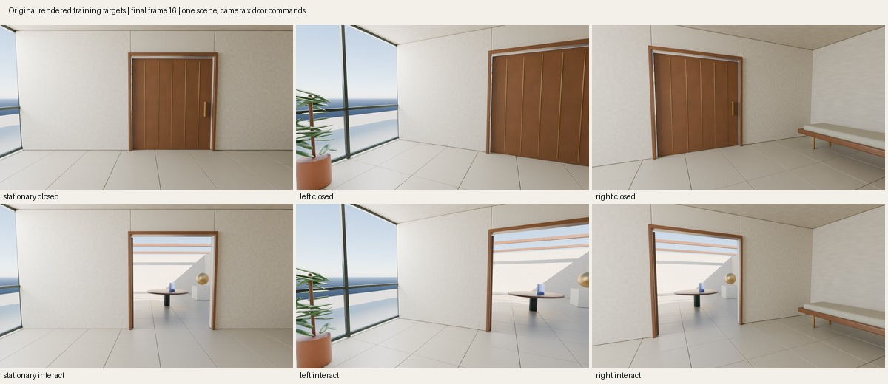

# Independent camera and door training targets

This original capture supplies six 17-frame branches: stationary, left turn, and right turn, each crossed with a closed door or a first-transition opening command. All 102 frames were rendered at native 1248×704 in one previously seen Atrium scene. They are training targets, not neural predictions or evidence of generalization.



All six branches use the same fresh first image, rendered once and copied byte-for-byte. This is a new native render of the original scene and initial state. It is not the older 512×288 image after upscaling/cropping, and old experimental inputs are unchanged. The native horizontal focal length is 624 pixels.

Each moving branch applies ±1.5 degrees of yaw on all 16 transitions, ending at ±24degrees. The interaction channel contains one pulse on the first transition. The scene implements an instantaneous remote door toggle to 102 degrees; it does not simulate reach, contact, forces or collisions. Camera and door commands can occur together. Command units remain raw meters/radians/pulse, with no normalization.

Records are destination-aligned: frame t carries the command applied between observations t−1 and t. Frame 0 has no incoming command. Realized camera matrices and door state are validation metadata, not model inputs. Requested deltas and the independent initial RGB may condition a model; future RGB belongs only to training/evaluation targets.

The local capture completed in 370.751 seconds with Blender 5.1.2, Cycles Metal and 32 samples. It rendered 66 unique camera/door states and copied 36 repeated states; each copy identifies its exact earlier PNG. Identical stationary states therefore have identical images. No physical time interval is assigned to these indexed transitions.

The [independent validation](results/validation-v1.json) checked 102 PNG hashes and native dimensions, 96 commands, identical initial files, reuse records, fixed-position right-handed camera matrices, native intrinsics, source identities and the saved scene hash. Recovered endpoints are +24.0000068° and −24.0000113°, with maximum camera-axis error 3.12×10⁻⁷. All 102 frames were also inspected in contact sheets. The validator does not infer door angle from pixels or establish a new Blender ray calibration.

## Download and validate

The [capture release](https://github.com/RaaghavC/open-worldline/releases/tag/atrium-camera-door-factorial-v1) provides the complete 107,524,994-byte ZIP in 14 ordered parts of at most 8,000,000 bytes. Its SHA256 is `a41caa2e287bb7cb644a37d9912cde7aed84f49891e7ed692d9332b771358019`. `dataset-index.json` records every part hash. The ZIP includes all 102 native PNGs, the unchanged manifest, original scene and CC0 dedication.

The supplied downloader verifies each part and the combined archive before extracting into a new directory. It uses public URLs with certificate verification and needs no credentials. From the repository root:

```sh
python -m pip install -r experiments/atrium_factorial/requirements.txt
python -m experiments.atrium_factorial.fetch --output /path/to/new-download
```

Then validate the extracted `/path/to/new-download/capture` directory:

```sh
python -m experiments.atrium_factorial.validate \
  --capture-root /path/to/extracted-capture \
  --capture-source experiments/atrium_factorial/render.py \
  --scene-source experiments/atrium_data/render.py \
  --expected-manifest-sha256 1872dea69d16b124fb7a0a9eefaff06ea2d850ff49f36bcf87fec8c10c82dada \
  --output /path/to/new-validation.json
```

The validator uses NumPy and Pillow and does not load Blender or a model. Its six analytic/synthetic tests also check changed command labels and mismatched image records. To rerender, use the original scene code in this repository:

```sh
blender --background --factory-startup --python-exit-code 1 \
  --python experiments/atrium_factorial/render.py -- \
  --output /path/to/new-capture --samples 32 --max-seconds 1200
```

The [model-facing reader](READING.md) separates the initial RGB and requested commands from future targets and validation metadata.

This capture addresses the missing independent camera alternatives. It cannot be compared with the older dataset to attribute a gain solely to adapter placement. Both placement arms must receive identical data in a later matched experiment. No model has been trained on these six clips yet.

The Blender capture script uses [GPL-3.0-or-later](../atrium_data/LICENSE). Original scene/data use [CC0-1.0](../atrium_data/DATA-LICENSE). The independent validator and contact-sheet code use the repository's Apache-2.0 license.
