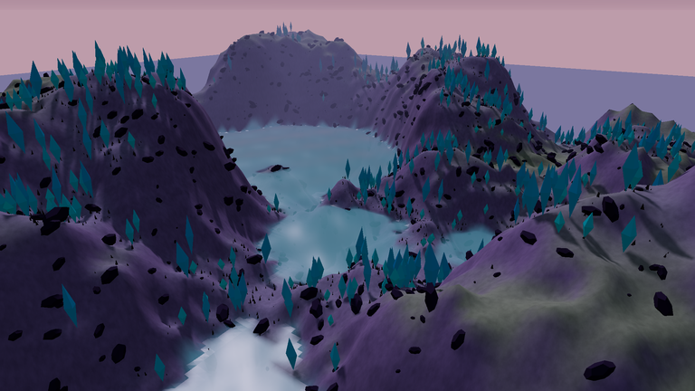
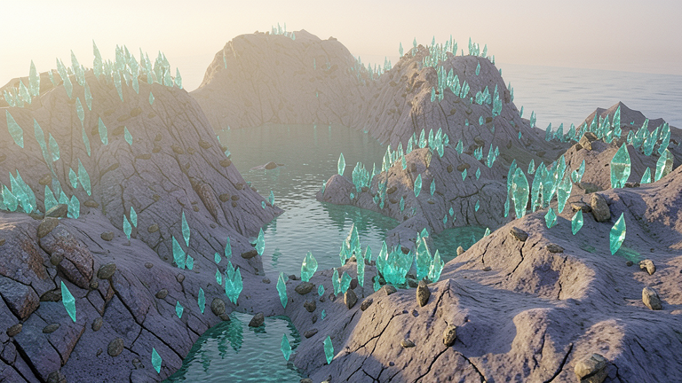
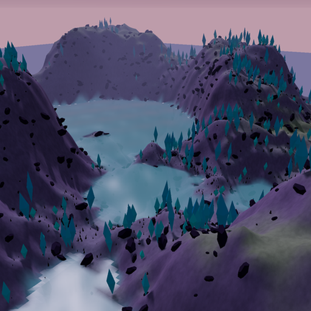
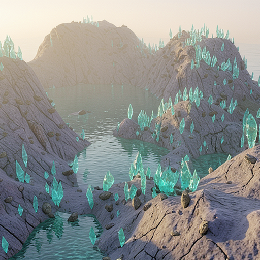
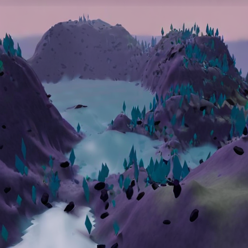

# Local FLUX4B appearance baseline

This experiment runs Black Forest Labs' released FLUX.2 klein 4B image editor through MFLUX on Apple Silicon. The weights are Runpod's third-party 4-bit conversion. It uses local inference. It is separate from Worldline's original models and application.

One image-editing run on September 7, 2026 added rock fractures, reflected water ripples, and translucent crystal facets to Worldline's original rendered scene. The major hills and water channel remain recognizable, while individual crystal shapes and sizes changed. This shows one local appearance-editing result. It does not establish exact geometry preservation, novel-view accuracy, learned dynamics, photographic realism, or Genie 3 parity.

| Original renderer input, resized | External FLUX4B output |
|---|---|
|  |  |

The original full-resolution programmed render is included as [renderer-original.png](images/renderer-original.png). Preprocessing converted it to RGB and resized its full frame from 2048 x 1152 to 768 x 432. The only generated image shown on the right is the output of the separately attributed external model. No downloaded photographs or external inference APIs were used.

## Measured on an M4 Pro with 24 GB unified memory

| Measurement | One observed run |
|---|---:|
| Model load, including synchronized weight materialization | 3.183 seconds |
| Full image generation, encoding through decoding | 51.951 seconds |
| MFLUX-reported denoising loop | 48.470 seconds |
| Peak MLX array allocation during generation | 6.45 GiB |
| Maximum sampled active plus cached MLX allocation | 7.12 GiB |
| macOS process maximum RSS | 1.12 GiB |

The test used 768 x 432 pixels, one reference, four steps, guidance 1.0 and seed 20260907. It used MFLUX's original sampler and memory-saving callback. The callback releases the text encoder and transformer after their respective stages. Model load and full generation were timed separately with device synchronization. No warm-run latency or repeated-seed result was measured.

MLX allocations and process RSS measure different, overlapping portions of memory. They must not be added. Process RSS alone misses Metal allocations. The raw monitor sampled every 50 milliseconds and can miss short spikes; the MLX allocator's peak counter is also recorded. The 16 GiB MLX memory setting is an allocator guideline, not an operating-system cap.

Numerical evidence is in [flux4b-result.json](results/flux4b-result.json), [memory samples](results/flux4b-memory-samples.json), and [memory summary](results/flux4b-memory-summary.json). The published wrapper changes local path defaults, reporting fields, PNG metadata saving, argument validation, and custom-input provenance labels from the executed wrapper. Its model initialization, sampling, memory callback and timing code are unchanged. Both script hashes are recorded.

The published FLUX PNG has local-path text and EXIF metadata removed. Its pixel data and compressed image-data chunks are unchanged. The original experimental file hash and published file hash are both recorded; the original file remains in the local experiment workspace. The reusable runner also saves PNGs without embedded local paths.

## Reproduce the image-editing test

Run these commands from the Worldline repository root on Apple Silicon with Python 3.11 and curl. The environment is separate from the Worldline application.

```sh
python3.11 -m venv work/flux4b-env
work/flux4b-env/bin/python -m pip install -r experiments/baselines/flux4b/requirements-lock.txt
```

Download the external weights explicitly. This retrieves **4,619,704,367 bytes, 4.62 GB**, from the pinned public repository and verifies the hashes. The weights are not included in Worldline:

```sh
python3 experiments/baselines/flux4b/fetch_weights.py --output work/flux4b-weights
```

The downloader reuses the shared verified-download helper. It rejects mismatched existing files, prevents symlinks from directing downloads outside the destination, and publishes verified temporary files without overwriting a concurrent file. Its saved `manifest.json` retains the FLUX manifest's original schema. To check existing assets without downloading or writing files:

```sh
python3 experiments/baselines/flux4b/fetch_weights.py --output work/flux4b-weights --verify-only
```

Verify files and prepare the reference without loading the model or using the GPU:

```sh
work/flux4b-env/bin/python experiments/baselines/flux4b/probe.py \
  --weights work/flux4b-weights --output-dir work/flux4b-result
```

Run one image:

```sh
work/flux4b-env/bin/python experiments/baselines/flux4b/probe.py \
  --weights work/flux4b-weights --output-dir work/flux4b-result --run
```

The runner requires local weights and uses Hugging Face and Transformers offline modes during inference. It refuses to overwrite an existing `result.json`. A different `--output-dir` preserves a later run separately. `--source` accepts another image, but the bounded test requires the same aspect ratio as the specified output. Dimensions must be positive multiples of 16 with at most 331,776 total pixels, steps must be between 1 and 64, and the seed must be between 1 and 4,294,967,295. The default source is the included original renderer image; a different file is labeled caller-supplied unless its SHA-256 matches that original. A custom prompt can be supplied with `--prompt-file`.

`requirements-lock.txt` records the tested environment; the shorter `requirements.txt` names direct dependencies. The runtime package is MFLUX 0.19.1, published August 26, 2026, wheel SHA-256 `e56f1e28e2cbad1153272ad87d3077f82442015f60214cdbc9b322c6003db513`. All 776 installed MFLUX package files matched that verified wheel. No MFLUX source was patched. Results on a different package, OS or device may differ.

## One WorldFM reference-conditioning test

After the image editor exited, one WorldFM inference used the FLUX4B result as appearance reference and the original terrain render as guide. Both inputs were center cropped and resized to 512 x 512, and the camera view was unchanged. The same pinned two-step core and MPS compatibility patch from the [WorldFM baseline](../README.md#worldfm-core-on-mps) were used.

**This test did not transfer the improved materials.** WorldFM's output kept the guide's smooth purple terrain and opaque triangular crystals. The successful FLUX edit and this negative result do not establish a working multiview graphics pipeline.

| Original guide | FLUX appearance reference | WorldFM output |
|---|---|---|
|  |  |  |

The first and only WorldFM inference took **5.882 seconds**, after **8.415 seconds** of loading. Sampled MPS driver allocation peaked at **5.46 GiB** and process maximum RSS at **4.80 GiB**. These overlap and must not be added. The checkpoint loaded with only the expected recomputed `pos_embed` missing and no unexpected keys. This run has no warm-latency measurement. Details and artifact hashes are in [worldfm-result.json](results/worldfm-result.json).

To reproduce this reference-conditioning test after following the existing WorldFM environment, source, patch and weight setup:

```sh
work/worldfm-env/bin/python work/worldfm/core_mps_probe.py \
  --weights work/worldfm-weights \
  --reference experiments/baselines/flux4b/images/flux4b-generated.png \
  --guide experiments/baselines/flux4b/images/renderer-reference.png \
  --output work/worldfm-flux4b-result --device mps --dtype float16 --seed 42 --runs 1
```

## Attribution and exact provenance

- [MFLUX](https://github.com/mflux-community/mflux) is MIT licensed. The [license copy](LICENSES/MFLUX-MIT.txt) covers that upstream code. Our measurement wrapper is original Apache-2.0 code under the repository license.
- [BFL's FLUX.2-klein-4B](https://huggingface.co/black-forest-labs/FLUX.2-klein-4B) has an Apache-2.0 [LICENSE.md](https://huggingface.co/black-forest-labs/FLUX.2-klein-4B/blob/e7b7dc27f91deacad38e78976d1f2b499d76a294/LICENSE.md), copied [here](LICENSES/FLUX2-klein-4B-Apache-2.0.txt). The inspected upstream revision is `e7b7dc27f91deacad38e78976d1f2b499d76a294`. The 4B refers to its generator; the package also contains the text encoder and VAE. Other FLUX variants have different terms.
- [Runpod's 4-bit conversion](https://huggingface.co/Runpod/FLUX.2-klein-4B-mflux-4bit) is pinned to `7ee1b3aa8178a1240050490072196a57da2bf2a9`. Its card says Apache-2.0 inherited from BFL and describes `mflux-save --quantize 4`, group size 64. It names the upstream model but does not record the original checkpoint revision it converted. This is not an official BFL quantized release. The conversion's complete downloaded file list and hashes are in [weights-manifest.json](weights-manifest.json).
- MFLUX's own image metadata names the configured BFL model. The actual weights in this test are Runpod's pinned conversion, recorded separately in [provenance.json](provenance.json) and the results.
- WorldFM is InSpatio's released model. Its code and checkpoint metadata declare Apache-2.0. The included VAE's original training provenance was not documented in the inspected release. See the existing WorldFM baseline's license caveat. No WorldFM weights are redistributed here.

The original renderer input, externally generated image, intermediate crops, outputs, dependency versions and weight hashes are recorded separately. No external model is presented as a Worldline-trained model, and no baseline is integrated into the application.
