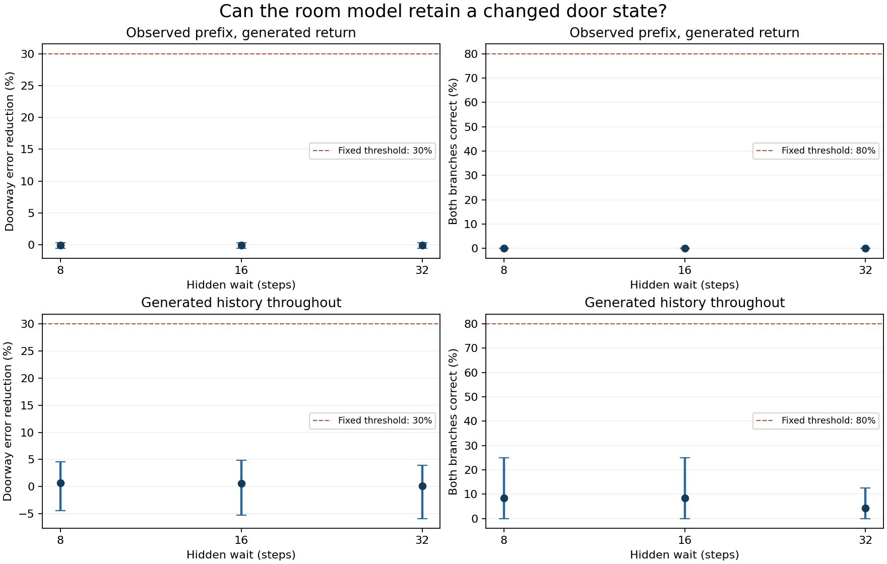
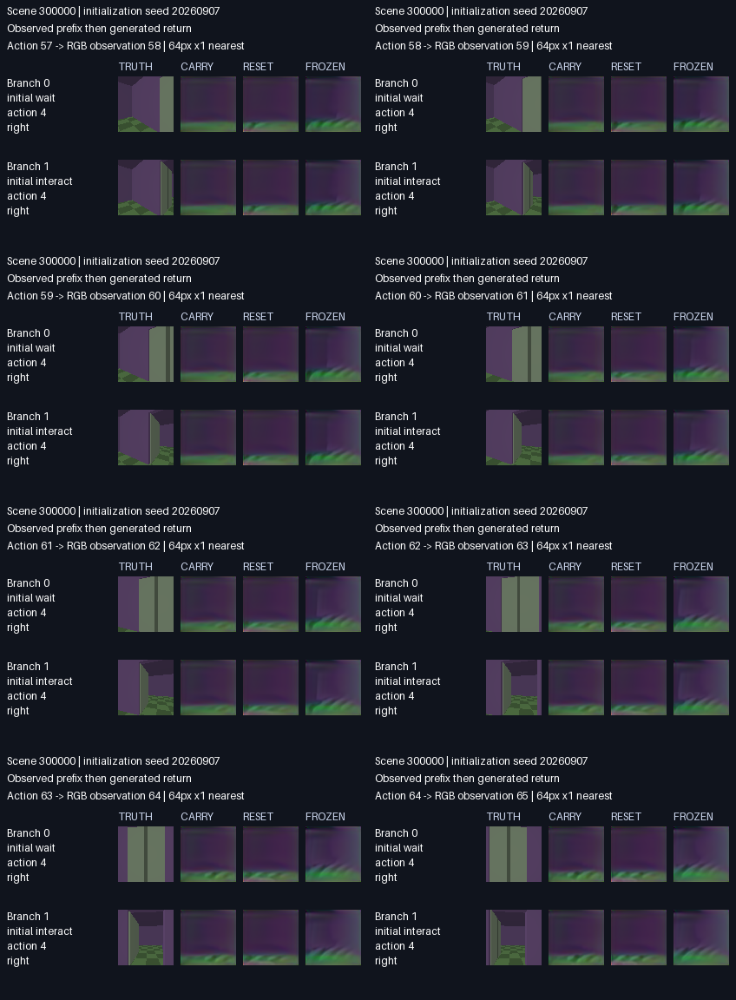

# Fixed memory study: memory tests failed

The complete six-arm, 512-update validation study failed every predeclared memory gate. Keeping the recurrent state produced almost the same returned-doorway error as resetting it at every step. Ordinary controls retained their one-step accuracy, but this did not establish successful memory.

At the standard 16-step hidden wait, mean doorway-error reduction across the three initialization seeds was **−0.09%** after an observed prefix and **0.61%** with generated history throughout. Both branches were correctly distinguished in **0%** and **8.33%** of scene/seed pairs, respectively. The fixed thresholds were 30% error reduction and 80% pair correctness, with improvement required in every seed. All three hidden-wait lengths failed in both protocols.

The [complete score tables](RESULTS.md) include all wait lengths, both protocols and the twelve control comparisons. [validation.json](validation.json) is the unchanged evaluator report. Its intervals resample the eight validation scenes together across models; they describe scene variation conditional on the three trained seeds.

Control measurements use true recent observations for each next-frame prediction. They include translation, an out-of-reach interaction and repeated door toggles. Every carry model stayed within 5% of both its matched reset model and the frozen predictor on every control type and the equal-type aggregate. This does not demonstrate long generated-history control accuracy.

The following contact page shows the last eight returned frames for the first validation scene and first initialization seed in fixed numerical order. Both branches and all three model references are present. This is an illustration, not the complete visual record.

The complete presentation retains all **48 videos** and **288 contact pages**, covering every generated frame in all eight standard validation scenes, three seeds and both protocols. The raw evaluator also retains all variable-wait and ordinary-control predictions. Playback uses enlarged original 64-pixel tiles without added detail; it is not a model-speed measurement. The complete 1.43 GB archive and separate 94.4 MB visual-review ZIP were verified locally. Repeated large-file transfer failures left the GitHub release draft unpublished. The [publication record](publication.json) identifies both complete local packages and this upload limitation. This directory publishes the scores, illustrations and verification records; it does not contain all raw predictions or videos.

All six trained checkpoints, recovery states and training records remain in the [training directory](../training-512-v2/README.md). The experiment followed the [fixed revised protocol](../training-protocol-v2/PROTOCOL.md); thresholds were not changed after evaluation. Reserved test scenes 400000 through 400031 were not generated or opened.

These results reject this trained global conditioning addition as a solution to the current room-memory task. They do not prove that recurrent memory cannot work. The visibly blurred, misplaced returned views also identify a limitation of the underlying image predictor. A subsequent [state-intervention diagnostic](../state-sensitivity-v1/README.md) found that swapping the two branch states barely changes the returned doorway, whereas zeroing the state changes the prediction. Neither intervention produces the correct pair of outcomes. That post-hoc experiment is separate from these fixed validation results.
