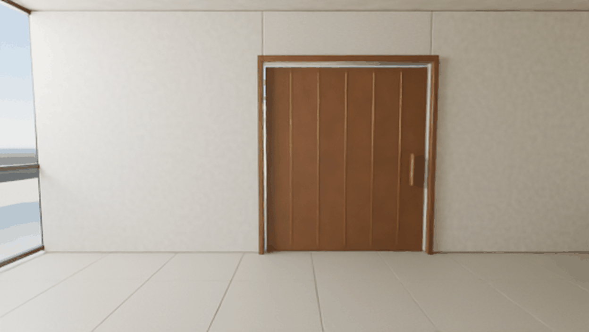
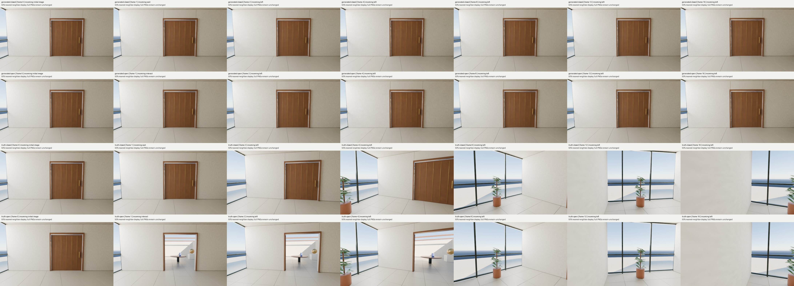

# First trained action clips: command following failed

**The 16-update adapter did not reproduce the door or camera commands in this pilot.** Both clips show a recognizable room with natural colors, but the door stays closed and the view remains nearly fixed. The captured interact outcome opens the doorway at frame 1, and the following 15 left turns change the view by a requested 112.5 degrees. The complete [34-frame visual review](reviews/parent-visual-review.json) records soft image detail and no severe prismatic distortion in these clips. Coherent appearance does not establish an interactive world model.

The original 947,712-parameter adapter was actually trained in the separate [fixed16 run](../fixed16-a100-v1/README.md). This run loaded that final checkpoint and generated two matched clips through the frozen native Wan2.2 TI2V-5B foundation. Only the initial interaction command differs. The independent [execution audit](audit/report.json) passed, while the rendered command response failed on this one room and noise draw. No further training took place here.

## Inspect the results

| Wait, then 15 left turns | Interact, then 15 left turns |
| --- | --- |
|  |  |

These are the exact decoder GIF files. Each contains 17 frames played at 120 ms per frame, lasting 2.04 seconds. **Playback is not generation speed. Both clips took 420.010 seconds in total**, including loading, value verification, sampling, decoding and artifact writing. GIF palettes quantize colors; the full recovery retains every native PNG and raw FP32 RGB frame.

The four-row comparison uses frame indices 0, 1, 2, 4, 8, 12 and 16, fixed before result inspection. Its labels identify the incoming command. Display is half size using nearest-neighbor sampling at the native aspect ratio; no image enhancement was applied. The parent reviewed all 34 generated frames, using the verified native contacts for 20 frames and individual PNGs for the other 14, then inspected this captured-outcome comparison.

## Numerical comparison and its limits

| Mean future-frame RGB MAE in [0,1] | Closed | Open |
| --- | ---: | ---: |
| Generated clip versus own captured outcome | 0.1835506 | 0.1955229 |
| Repeat starting image versus captured outcome | 0.1789626 | 0.1903559 |
| Generated clip versus starting image | 0.0193689 | 0.0194030 |

All averages exclude the conditioned reconstruction at frame 0 and include every future frame, 1 through 16. At all 16 future indices, the requirement that both generated branches be closer to their own captured outcome than the opposite outcome fails, in both full-frame and paired-truth-region comparisons. Small generated branch differences are present: at frame 1 their MAE is 0.0010070, compared with 0.0808995 for the captured pair. The clips are not identical, but their difference does not reproduce the intended response.

The exact [analysis report](analysis/report.json) retains per-frame MAE, MSE, PSNR, both truth alternatives, starting-image comparisons and file/tensor hashes. The [interpretation](analysis/interpretation.json) and [summary](summary.json) keep numerical execution separate from the behavior finding. These RGB errors measure image correspondence, not image quality. Camera mismatch can dominate them. The paired-truth region contains any pixel with an RGB channel difference of at least two byte levels; it includes illumination and renderer differences and is not a door segmentation.

Generated frame i maps to capture frame i. The established derived closed-start0 correction replaces 18 one-level RGB channel values with the canonical open starting image before resizing; raw captures remain unchanged. All frames use the same LANCZOS resize from 512 × 288 to 1252 × 704 and crop `[2,0,1250,704]`, yielding 1248 × 704. Enlarging the original images adds no captured detail. Later camera turns move the doorway out of the view, so late RGB differences cannot establish hidden door-state memory.

This is one seen room and one shared saved noise draw. Both text-conditioning branches receive commands during CFG sampling, while training used the positive context only. The result does not isolate why control failed, establish an adequate training budget, or demonstrate unseen-scene behavior, learned physics, persistent memory, novelty or Genie 3 parity.

## Execution and retained evidence

| Measurement | Result |
| --- | --- |
| Output per arm | 17 frames at 1248 × 704, including one conditioned reconstruction |
| Sampler per arm | Native UniPC, 50 steps, shift 5, CFG 5, 100 predictions |
| Closed / open sampling interval | 44.1531 / 43.8228 seconds |
| Closed / open decode-only interval | 3.4039 / 3.2621 seconds |
| Foundation loading | 151.2152 seconds |
| Foundation value verification before / after | 53.9142 / 53.9827 seconds |
| Complete parent run | 420.0095 seconds |
| Frozen foundation | All 825 value hashes unchanged |
| Adapter | Final fixed16 checkpoint unchanged; no gradients or optimizer updates |

These intervals are nested within the complete run. Their sum is not a second total. The exact [parent](metrics/parent.json), [core](metrics/core.json), [decoder](metrics/decode.json), child terminal records and [admission](plans/admission.json) are retained. The [audit source](audit/audit.py) and [inventory](audit/inventory.json) bind the passed independent checks: source and input identity, 100 saved solver states across both branches, clean observed prefixes, the original foundation, raw RGB/PNG mapping and resource limits. The audit did not replay all solver velocities or assess image quality.

The final adapter SHA256 is `d15994f0cb1bdf54e264e75ecddd9fd126f3e32df04a6e913703d18b95e0db3d`, available from the [fixed16 checkpoint](../fixed16-a100-v1/checkpoint-0016/adapter.safetensors). It is not duplicated here. No external pretrained model weights are included.

## Source, earlier stop and reproduction

The four exact executed local files are in [source/v2](source/v2). The [source map](code-provenance.json) binds all 66 repository dependencies through existing exact published snapshots, without duplicating them. The repository archive identifies executed commit `099eeae6268da852b0acb580258e4c168f900520`; the later release target identifies publication context. The original adapter, native sampler, native decoder, saved observation, noise and text are preserved.

The [v1 stop](history/v1-stop.json) occurred before model execution because the new A100 reported 2,097,152 more total memory bytes than the training GPU. The [hardware record](history/hardware-difference.json) shows all other fields matching. The reviewed v2 policy allows equal or greater reported capacity while preserving every other hardware/runtime field, all limits and model calculations. It does not permit smaller capacity or different precision settings. The [v1 source](source/v1), [preservation record](history/v1-preservation.json), [eight-check v2 CPU report](preflight/cpu-v2.json) and [independent reviews](preflight/independent-v2.json) remain available. Historical prepared/pending fields in retained records are not rewritten after execution.

The [analysis sources](analysis/source), [eight pre-run CPU checks](analysis/cpu-check.json) and [five downloader checks](downloader-cpu-review-v1.json) are retained exactly. Analysis source snapshots preserve the measured work-directory layout and are provided for inspection and replay in that layout; they are not a new installed command-line package. No model executes during analysis or download verification.

## Full recovery and license boundaries

The full archive contains **443 unchanged files totaling 806,023,735 bytes**, in **nine public transport parts totaling 719,774,742 bytes**. The derived [public index](recovery/index.json) SHA256 is `d28990c7625822e14ca6772a93cf12fd680bd88ef5dca915354f15bebcc47fc8`; the compressed stream SHA256 is `94f18b51add5c910446cadf830ddcc66f6c378c067c15fc6b2f1f38e6eebc7bf`. [Original recovery verification](recovery/recovery-verified.json) passed. The original recovery used eight parts. Only the absent final upload was split into two contiguous 44,887,371-byte pieces; [local verification of the nine-part transport](recovery/local-nine-part-verification.json) recovered every original file. The [derivation record](recovery/transport-derivation.json) proves the same compressed stream and unchanged 443-file inventory. The [original recovery index](history/original-recovery-index.json), SHA256 `765ed01dde7f9b3720b6d56ed907230d8a7f25bd7fe0e9d3bba5cdbe7b6b8741`, remains available in Git and as the release asset `original-index.json`. The prior [eight-part download metadata](history/original-release-download.json) is retained as history. The [public release](https://github.com/RaaghavC/open-worldline/releases/tag/wan22-action-visual-a100-v1) is live. All 23 asset sizes and SHA256 digests were [verified](release/remote-asset-verification.json), and a [fresh public HTTPS download](recovery/public-download-verification.json) recovered all 443 files exactly. The [published release record](release/published-release.json) and [download metadata](release-download.json) retain these identities. See [DOWNLOADER.md](DOWNLOADER.md).

Original project code, adapter and experiment files follow [Apache-2.0](licenses/WORLDLINE-APACHE-2.0.txt), except separately licensed original captures and retained external material. Original Atrium images/metadata retain [CC0](licenses/ATRIUM-CC0.txt). External Wan source/model/VAE retain their [Apache license](licenses/WAN-APACHE-2.0.txt) and [NOTICE](licenses/WAN-NOTICE.txt). The bundle includes no credentials or provider account-lifecycle logs. [code-provenance.json](code-provenance.json) records exact copies; [privacy-scan.json](privacy-scan.json) records the selected-text scan.
