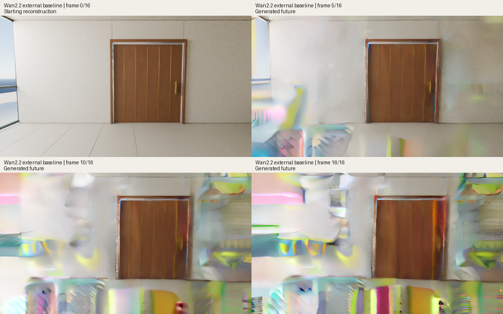

# Complete native clip: visual quality failed

The attributed Wan2.2 TI2V-5B model completed all 50 sampling steps and decoded all 17 frames on the 24 GB M4 Pro. The first frame reconstructs the known starting image. The 16 generated future frames develop colored, warped surfaces around the doorway. This run does not provide a usable visual foundation for the requested world model.

The overview shows four fixed frame positions. The [complete preview](decode/result/preview.gif), all [17 original PNG frames](decode/result/frames), [raw decoded FP32 tensor](decode/result/decoded.safetensors) and [final latent](core/result/latents.safetensors) are retained. Preview playback at 10 frames per second is separate from generation speed.

| Measured work | Seconds |
| --- | ---: |
| Verify and load the selective BF16/FP32 core | 91.01 |
| 50 UniPC steps, 100 model calls | 348.64 |
| Verify and load the separate FP32 codec | 4.03 |
| Decode all 17 frames | 74.38 |
| Write original frames and raw decoded tensor | 2.27 |
| Complete parent run, including startup and checks | **527.57** |

Peak sampled GPU driver allocation was 10.12 GiB for the core and 10.30 GiB for decoding. Minimum sampled available system memory was 3.34 GiB. The transformer process exited before the codec process started. Both stages stayed within the existing 900-second combined deadline, 18 GiB allocation limit and 2 GiB available-memory floor. Sampled peaks are not continuous upper bounds.

Inputs are the exact retained noise, a separately encoded starting image and genuine cached positive/native-negative text. There is no action input, adapter, future RGB, target access or training in generation. Sampling uses 50 official UniPC steps, shift 5, guidance 5, integer native times and the native 48-channel codec. The known first 144 tokens use time zero, with the clean prefix restored before each model call and after every solver update. All 100 call-boundary and 50 update-boundary checks passed. This verifies the recorded execution conditions; it does not establish image quality or numerical equality to CUDA kernels.

The experiment uses 17 frames at 512 by 288, below the model's advertised 720P setup. The port also uses explicitly specified mixed precision and FP32 cached text on this Mac. The cause of the visual failure is unresolved. A complete real-video codec reconstruction and a renewed sampling comparison are the next diagnostics. Action training is not admitted by this failed visual result.

The [parent report](metrics.json), [core report](core/result/metrics.json), [decoder report](decode/result/metrics.json) and [publication manifest](publication.json) retain the exact source and measurements. The reports' `passed` status means all declared execution checks completed. This README separately records the failed visual inspection. The original machine reports have not been rewritten to imply a quality score.

This is an external pretrained baseline, not an original Worldline model, a memory result, a generalization benchmark or a Genie 3 comparison. Original adapter development remains separate. Full external foundation weights are identified by hash and are not redistributed here.
