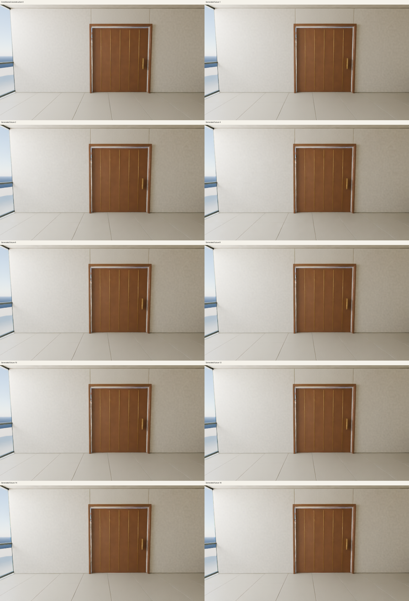

# Completed larger-spatial Wan reference

**The severe earlier prismatic distortion is absent in this one 17-frame result.** External pretrained Wan2.2 TI2V-5B produced a recognizable beige room and closed brown door at 1,248 × 704 on an A100. The clip is nearly static: the door stays closed, there is no clear purposeful camera movement, fine detail remains soft, and the prompt's plants are missing. This is a bounded pretrained-model diagnostic, not an original Worldline world model.

The [exact GIF](previews/clip-preview.gif) is a palette-quantized preview. Its 17 frames each use 120 ms, about 8.33 frames per second playback, totaling 2.04 seconds. Playback rate does not measure generation speed. The [all-frame review](audits/clip/visual-review.md) inspected every original PNG individually; the [frame-hash record](audits/clip/visual-review.json) identifies all 17. The contact sheet shows ten complete, unresized frame regions.

## What ran

The run used the original 825 FP32 core tensors, native CUDA BF16 autocast, original FlashAttention 2 and complex RoPE, the separate original 48-channel FP32 VAE, genuine cached text, and the unchanged CPU UniPC schedule: 50 updates, shift 5 and CFG 5. Both guidance branches retain the clean observed prefix. There are 858 observed-prefix tokens and 4,290 total tokens at this spatial size. Frame zero is a conditioned reconstruction; frames 1 through 16 are generated futures.

The [whole clip](metrics/clip/parent.json) completed in **594.877 seconds**. Its [measured admission](plans/clip.json) was 774.619 seconds under a fixed 1,800-second total limit. Setup, weight download and recovery are outside those model-run intervals.

| Measured interval | Seconds |
| --- | ---: |
| Both-size codec parent | 56.754 |
| Fresh-encoding baseline pair parent | 202.061 |
| Larger-spatial pair parent | 203.161 |
| Clip core loading and checks | 180.423 |
| Fifty-step sampling loop | 330.853 |
| Complete clip core worker | 516.181 |
| Clip VAE loading and checks | 33.676 |
| Clip VAE decode | 3.700 |
| Complete clip decoder worker | 57.686 |
| Whole clip parent | 594.877 |

Parent and worker totals include their operation/load intervals; these rows must not be added together. Exact precision, hardware, timing, completion and limits remain in the [core record](metrics/clip/core/metrics.json), [decoder record](metrics/clip/decode/metrics.json) and their terminals. No measured JSON was rewritten for this payload.

## What the audits prove

The four independent saved-file audits passed: [codec](audits/codec/report.json), [baseline pair](audits/baseline-pair/report.json), [larger-spatial pair](audits/spatial-pair/report.json), and [clip](audits/clip/report.json). They recompute saved tensor identities, shapes, finite values, exact guidance arithmetic for the pairs, the 50-step order and restored prefixes, all original PNG pixels, contact image regions, GIF timing, prior-stage identity and the admission arithmetic. The original 196 VAE parameter/storage records are checked against the pinned source checkpoint.

The clip audit does not replay the solver because per-step velocities were not retained. The core catalog check verifies the saved 825 source-weight identities, not live GPU memory. The numerical reports retain `quality_assessed: false`; visual review is the separate note linked above. All audit sources and recovered inputs were unchanged during the audits.

The [two-size codec initial reconstructions](previews/codec-spatial-reconstructed-initial.png) and [baseline reconstruction](previews/codec-baseline-reconstructed-initial.png) are codec measurements. Their 17 repeated-latent timing-proxy frames in the full evidence are not generated futures.

## Why this is not a resolution-only conclusion

The earlier small A100 clip used an MPS-encoded initial observation. This run resized/cropped the original image and encoded it freshly on CUDA. The [fresh-encoding baseline comparison](audits/baseline-pair/earlier-a100-guidance-comparison.json) retains identical baseline noise, token times, future initial latents, text and original weight hashes, but a different observed latent. Future guided-velocity relative RMSE was 1.753778%, using the earlier A100 tensor's RMS as the denominator. This is a descriptive first-step difference, not a quality test or numerical-equivalence result.

That pair cannot exclude amplification over 50 steps. A complete small baseline clip using the same fresh CUDA encoding remains necessary before attributing the improved appearance solely to spatial size. This experiment kept 17 frames, shorter than the upstream configured 121-frame example; text caching and the CPU solver also remain declared choices. Upscaling the input adds no new scene detail.

There was no action adapter, training update, door-opening command or long-term memory test. One scene, one sample and a nearly static two-second preview do not establish broad visual quality, interactive world generation, research novelty or Genie 3 parity. The original action-model work remains separate.

## Complete raw evidence and download status

The final recovery contains **536 exact files totaling 803,541,766 bytes**, transported in **eight parts totaling 636,908,966 bytes**. Every earlier recovered codec/pair file is preserved exactly, as recorded by the [preservation witness](recovery/earlier-recovery-preservation.json). All plans, actual stages, setup evidence, original input copies, source snapshots, weight-load records, 50 saved latent steps, all 17 raw RGB frame shards and all original PNGs are retained. No bad frame or partial result was selected for removal.

The [original final index](recovery/index.json) records every file and part. Its SHA256 is `834053b3fd4b0428740bdc78853225dde07ee269bdb6e43bc2b88916f0f6690d`. The complete compressed-stream SHA256 is `e900c18faab7de9747c2369ce5579e3ffd6352731d5ba4b3f9fa6139b5635136`. [Local recovery verification](recovery/recovery-verified.json) passed. Each transport part is at most 90,000,000 bytes; native RGB and latent files remain sharded.

The [complete public release](https://github.com/RaaghavC/open-worldline/releases/tag/wan22-spatial-reference-a100-v1) contains all eight raw parts, the original index, recovery record and component licenses. All 15 asset sizes and GitHub SHA256 digests match the local files, as recorded in [asset verification](recovery/release-assets.json).

A fresh unauthenticated HTTPS download recovered and verified all 536 original files. The [download verification](recovery/public-download-verified.json) records the complete stream and pinned metadata hashes. The [independent clip audit on that downloaded tree](recovery/public-download-clip-audit.json) passed with unchanged sources and inputs. No model ran during either check.

Use the [public downloader](fetch_artifacts.py) with the [pinned asset metadata](release-download.json) and [instructions](DOWNLOADER.md). It verifies the index, ordered parts, complete archive and every extracted file without a provider account or model access. The [five-test CPU report](downloader-cpu-review-v1.json) describes its bounded offline tests. It also supports verification of already downloaded assets.

## Source and reproduction

Executed runtime commit: `ffee84129b9c29a7d3c29449e10b6a18a660aebf`. Auditor commit: `1142cbbd409285cd69fbc7c637a4153ad5eb91bc`. The [provenance map](code-provenance.json) binds all 29 executed runtime identities, all 34 audit identities and every exact copied artifact. Their shared checked [source bundle](source/) appears once. The complete release additionally retains each run's original snapshots and full inputs.

The runtime [CPU gate](preflight/runtime-cpu-v2.json) passed 91 tests; the separate [auditor gate](preflight/auditor-cpu-v1.json) passed 36. The [transfer record](preflight/source-transfer-v2.json) identifies the exact source archive used remotely. These are software checks, not model-quality evidence.

Run `python3 verify_payload.py` from this directory to check the small payload's indexed file identities without a network or model call. After release download and extraction, use the existing `experiments.wan22_native.spatial_audit.run` commands with the recovered codec, matching pair, clip and packet roots. The VAE source-storage check additionally needs the original external `Wan2.2_VAE.pth`, which is excluded from this payload and release. The downloader checks archive integrity without that checkpoint.

The task owner confirmed deletion through an explicit GET 404 and successful complete-list absence, then revoked the temporary key and removed its local private files. Resource/account/credential records are maintained separately. No account balance or final billing claim is included here.

Read [component license notes](LICENSE-NOTES.md). Wan remains an external pretrained foundation. Original scene imagery, local code and upstream source retain their separate stated licenses; this payload does not relabel the pretrained model or its outputs as newly trained original weights.
