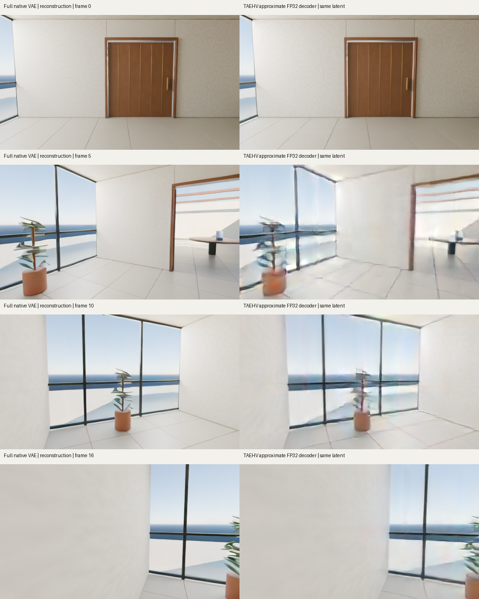
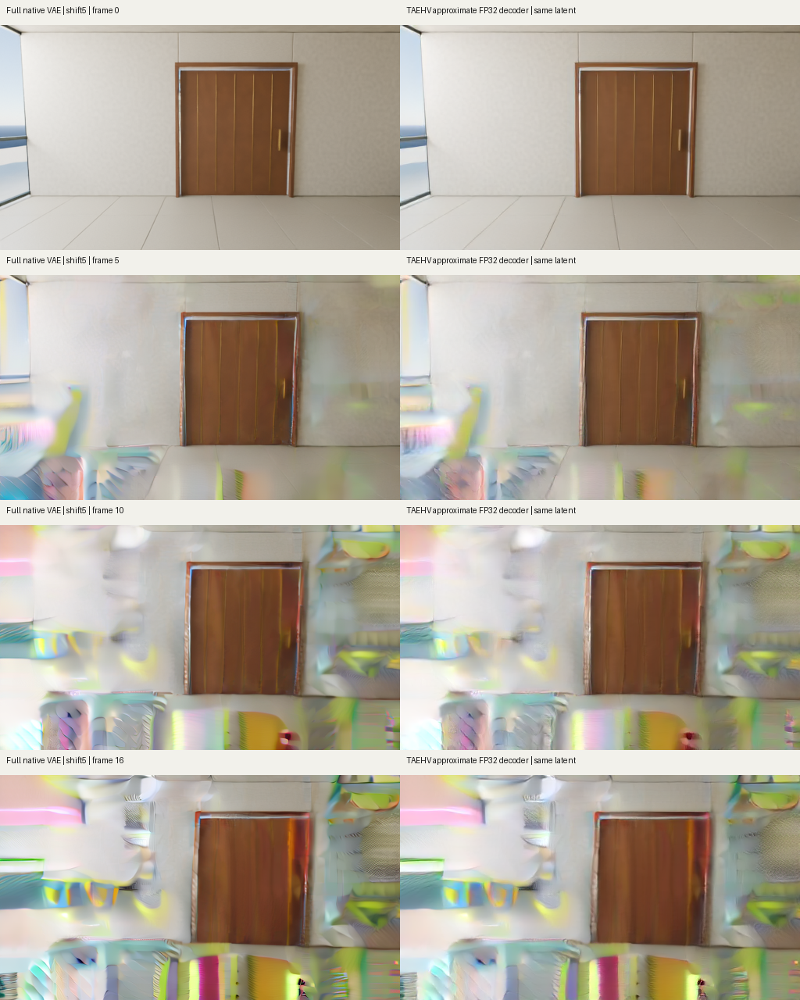
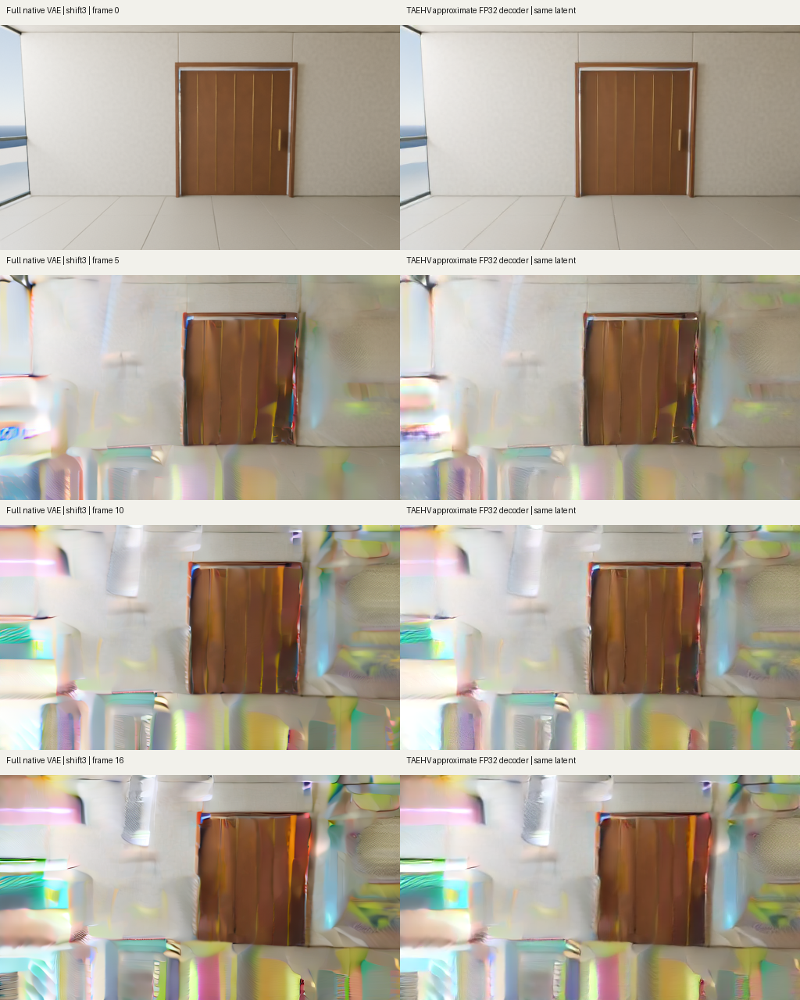

# Three measured TAEHV decoder comparisons

All three separate FP32 MPS decoder runs completed and retained their 17 frames at 512 × 288 pixels. The external TAEHV decoder is faster than the measured full VAE decoder, with lower reconstruction accuracy. It does not remove the severe colored distortions in either generated control. These runs reused saved latents. They performed no transformer sampling or model training.

| Saved input | TAEHV decode interval | Complete parent interval | All-frame PSNR against original RGB |
| --- | ---: | ---: | ---: |
| [Real Atrium reconstruction](reconstruction-v1/decoder/result/metrics.json) | 0.8690 s | 5.0325 s | 27.2304 dB |
| [Generated shift-5 control](shift5-v1/decoder/result/metrics.json) | 0.3634 s | 4.6019 s | No original-RGB accuracy score in this comparison |
| [Generated shift-3 control](shift3-v1/decoder/result/metrics.json) | 0.3656 s | 4.7096 s | No original-RGB accuracy score in this comparison |

The [earlier full VAE roundtrip](../../action_data/results/roundtrip-v1/result/metrics.json) decoded the same real target latents in 61.3685 s and reconstructed the 17-frame clip at 32.2628 dB. Its all-frame MAE was 0.0085644 on RGB in `[0,1]`; TAEHV's MAE is 0.0202728. These are separate measured decoder intervals on this Mac. They exclude video-model denoising. Each decoder was measured once per input. The later TAEHV runs followed the reconstruction run, so the difference between their timings does not establish a repeatable input-dependent speed effect.

The parent intervals include loading, comparison and artifact writing. Worker load times were 0.1022, 0.1092 and 0.1138 s. Sampled MPS driver allocation peaked at 1,236,205,568 bytes in every run; the smallest sampled available system memory across all runs was 8,991,506,432 bytes. Every run stayed within the declared 900 s, 18 GiB and 2 GiB minimum-available-memory limits. Sampling can miss short memory peaks.

## Image results

The reconstruction preserves the doorway and room layout. The approximate decoder blurs and warps thin window lines, floor seams and plant details more than the full VAE. In both generated controls, the later walls and doorway remain distorted and covered by bright colored patterns. Switching the decoder did not resolve that failed visual result.

All 51 native-size PNGs and the raw FP32 RGB tensors are retained in the three result directories. The preview GIFs play at 10 FPS and use display compression. Playback speed is independent of decoder timing and model-generation speed. The real clip contains 17 reconstructions; each generated source contains one conditioned initial frame and 16 generated future frames. This comparison generated no new latents.

## Independent artifact verification

The [audit report](independent-audit-v1/report.json) and [exact audit source](independent-audit-v1/audit.py.txt) retain these checks:

- All 51 PNGs exactly equal `rint(255 × retained_FP32_RGB)` and have the expected frame index and dimensions. Contact-sheet picture crops match the same pixels; all three GIFs contain 17 frames.
- Saved input values match the source latents exactly. Each `[1,48,5,18,32]` input was consumed as three then two latents, yielding nine then eight RGB frames. The source trims its three startup frames once. No frames were dropped, padded or resized.
- All file, input, output and checked-source hashes match. The pinned 22,884,021-byte external weight file was independently hashed without loading its tensors.
- All first-frame, later-frame, all-frame and per-frame scores were independently recomputed from retained tensors with NumPy. The audit imports no Torch and executes no model.
- Parent and child status records completed successfully with exit code 0. The run records report finite pixels and cleared streaming state. The frozen source and CPU checks verify cache reset in `finally` and reference-pixel materialization after decoding.

The generated-control PSNR values, 30.9873 dB and 30.4138 dB, measure agreement between the two decoders on the same generated latents. They are not accuracy against a correct future scene. The real-clip score can be compared against original RGB because those frames were supplied independently after decoding.

The frozen original [CPU report](../cpu-v1/tests.json), [source review](source-review-v1/report.json) and [weight-download record](weight-download.json) remain available. Their earlier pre-execution statements describe their own stage. The later measured runs supply the execution evidence.

## Preservation and reproduction

Each run contains all 43 raw files. Forty-two remain byte-exact; only four operational absolute paths in `decoder/launch.json` were changed to repository-relative strings. Each run's `publication.json` records raw and published hashes and identifies every substituted field. The past monotonic deadline remains untouched, so the retained launch record is evidence, not a replay command. No metrics, source, tensors or pixels were changed. Raw work directories remain unchanged.

The [pre-execution README and initial manifest](pre-execution-history/README.md) preserve the earlier documentation. [index.json](index.json) binds the new result package. External weights are attributed in the [pinned source record](../source.json) and are not redistributed here.

Use the [existing reproduction instructions](../README.md#reproduction) with the public source runs:

- Reconstruction: `experiments/wan22_native/action_data/results/roundtrip-v1`
- Shift 5: `experiments/wan22_native/sample-results/clip50-v1`
- Shift 3: `experiments/wan22_native/shift3/results/clip50-v1`

Request a fresh output directory and explicitly supply the downloaded, verified external weight file. This is an attributed approximate-decoder experiment. It establishes neither an original model nor a world-model quality improvement.
