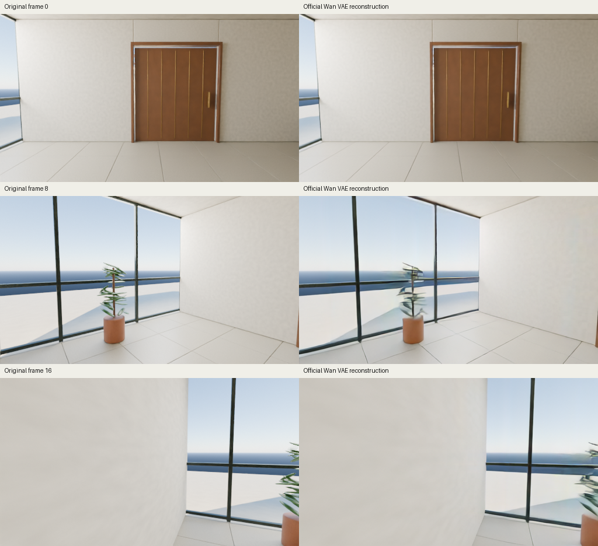

# Official Wan VAE reconstruction check

The external pretrained Wan VAE encoded and reconstructed 17 original 512 x 288 Blender frames on the M4 Pro with 24 GB memory. The result measures the detail this codec preserves before any video-model training. It is not a video generated from actions or a prompt.

The tested clip contains the open-action branch of one original atrium scene, frames 0 through 16. The first frame shows the closed door, followed by the scripted door toggle and camera rotation. The [input record](input-provenance.json) identifies the original scene, rendering settings, hashes and CC0-1.0 data terms. The scene seed changes color and leaf placement; this sample is not an independent architectural layout.



In this sample, the codec preserves the large room surfaces and door shape. Thin plant leaves blur and some window edges bend or smear. Plain walls occupy much of the image, so aggregate image scores can understate errors on small objects.

| Measurement | Completed float16 MPS attempt |
|---|---:|
| Whole-clip PSNR | 32.4967 dB |
| Mean frame SSIM | 0.970822 |
| Load and verified checkpoint | 1.057 s |
| First frame encoded alone | 2.372 s |
| Full 17-frame encode | 18.839 s |
| Full decode | 28.242 s |
| Measured interval after input loading and hashing | 52.706 s |
| Sampled peak Metal driver memory | 12.12 GiB |
| Sampled peak active Metal tensors | 1.73 GiB |
| Sampled peak process RSS | 0.785 GiB |

All 194 state keys loaded exactly, with no missing or unexpected keys. The VAE contains 126,892,531 parameters. All latent and decoded tensors were finite. The first latent frame from the complete clip matched the first image encoded alone exactly: maximum absolute difference 0.0. This tests initial-frame causality on this input and implementation; it does not test a persistent-memory model or a causal video generator.

The [completed report](results/metrics.json) includes every input-frame hash, per-frame PSNR and SSIM, and timings. [Memory samples](results/memory.jsonl) were collected approximately every half second. RSS and Metal allocations overlap and must not be summed. Sampled peaks can miss shorter allocations. PSNR uses the whole RGB clip in [0,1]. SSIM uses an 11-pixel Gaussian window with sigma 1.5, population covariance and RGB-channel averaging. Metrics use decoded floating-point pixels before PNG rounding.

An earlier float32 attempt stopped during decoding at the system-memory guard after 49.02 seconds. Available system memory was 1.93 GiB, below the required 2 GiB. It had allocated 17.25 GiB through the Metal driver. Its [failure record](results/float32-stopped.json) and [memory samples](results/float32-memory.jsonl) are retained. That attempt did not finish and has no reconstruction score. The completed retry changed both computation precision and the allocator-cache policy, so this is not an isolated float32-versus-float16 quality comparison.

## Source and weight attribution

The neural-network source [vendor/wan_vae.py](vendor/wan_vae.py) is copied without modification from the official [Wan2.1 revision 9737cba9](https://github.com/Wan-Video/Wan2.1/blob/9737cba9c1c3c4d04b33fcad41c111989865d315/wan/modules/vae.py), under Apache-2.0. [Source hashes](vendor/source-manifest.json) and the license are included. The original `helper.py` loads the verified official VAE using `weights_only=True`, preserves the official network and normalization, and calls encode/decode with an explicit device and dtype. It avoids the upstream wrapper's CUDA-only autocast.

The external checkpoint is the [official Wan VAE](https://huggingface.co/Wan-AI/Wan2.1-T2V-1.3B/blob/37ec512624d61f7aa208f7ea8140a131f93afc9a/Wan2.1_VAE.pth), 507,609,880 bytes, SHA256 `38071ab59bd94681c686fa51d75a1968f64e470262043be31f7a094e442fd981`. It remains external. The test uses its deterministic encoded mean, the official 16-channel normalization and clamped decoder output. The successful computation used float16 on MPS, with automatic CPU operator fallback disabled and unused allocator cache cleared between stages.

## Reproduce

From the parent `wan_adapter` directory, install the optional codec requirements and explicitly download the VAE if it is not present:

```sh
.venv/bin/pip install -r codec/requirements.txt
.venv/bin/python fetch_weights.py --output external-weights --include-vae
PYTORCH_ENABLE_MPS_FALLBACK=0 .venv/bin/python codec/ceiling.py \
  --weights external-weights/Wan2.1_VAE.pth \
  --frames-dir /path/to/original/dense-pair/open \
  --output results/codec \
  --device mps --dtype float16 --start 0
```

The input directory must be the `open` or `closed` arm of an original Atrium capture with a complete parent `manifest.json`. The current runner verifies native 512 x 288 images and their hashes through `capture_data.load_window`; it rejects arbitrary folders instead of assigning them a data license or color transform. Generate the original capture using the [atrium data renderer](../../atrium_data/README.md). The program does no crop or resize. It saves all 17 reconstructions, the input copies, a comparison sheet, measured results, and a `latents.safetensors` cache containing `full_clip` and `first_frame_alone`. Use only the latter as the initial observed-image condition. No text encoder or denoising transformer is loaded by this check.

The three displayed original frames and reconstructions are included. Complete clips and their latent caches are generated by the reproducible command and are not bundled here.

The measured source is archived in [results/measured-source/ceiling.py.txt](results/measured-source/ceiling.py.txt). After measurement, the current CLI gained output-reuse refusal and explicit Atrium-manifest validation. These validation edits are recorded separately in provenance; the reported reconstruction was not rerun or relabeled as execution of the revised CLI.

A later [same-latent precision diagnostic](results/generated-base-fp32/README.md) completed full float32 decoding using allocator cleanup after each existing temporal chunk. It compared the saved failed generated clip with its earlier float16 decode. The lattice pattern remained, with future-frame MAE 0.00105 between decoding precisions. This later test uses generated latents and is separate from the original-image reconstruction ceiling above.
