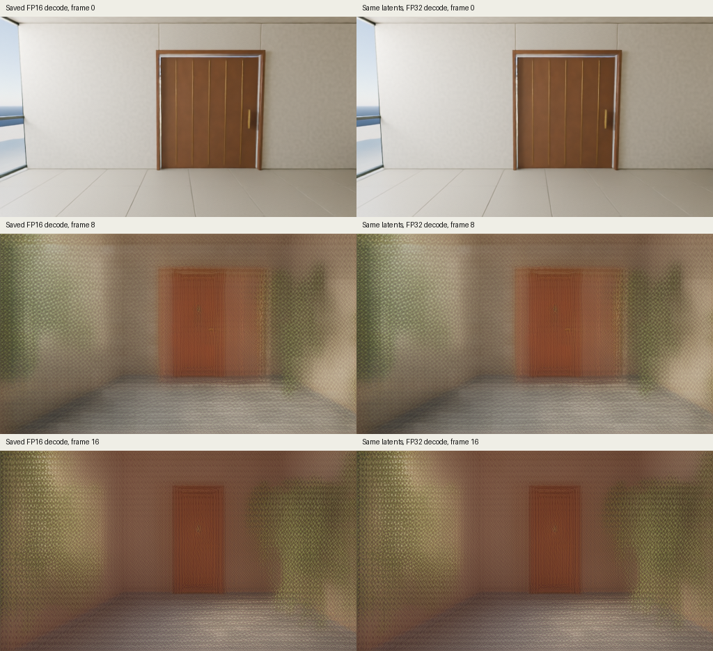

# Same-latent decoder precision check

The same saved base latents were decoded with the official Wan VAE in float32. The lattice pattern and blur remain. Float32 decoding does not explain or resolve the visible failure of this clip.



This check loads no denoiser, text encoder, future target images or new noise. The input is the existing `base` tensor in the [saved latent pair](../../../real_results/sample20/generated-latents.safetensors), SHA256 `ba164a9bd56120a8cefb5057b69f8bcac2e842207f1ffa172cd36e76643d8bd2`. Each decoded clip contains one reconstruction of the observed initial frame and 16 generated future frames. These are model outputs, not original captured video.

| Measurement | Result |
|---|---:|
| FP32 full decode | 27.788 s |
| Measured validation/load/decode/artifact interval | 30.132 s |
| Peak sampled Metal driver allocation | 10.35 GiB |
| Peak sampled active Metal tensors | 2.42 GiB |
| Peak sampled process RSS | 0.532 GiB |
| Future-frame MAE versus saved FP16 PNGs, RGB [0,1] | 0.00104876 |
| Mean frame SSIM versus saved FP16 PNGs | 0.999069 |

All 194 state keys loaded exactly and all decoded pixels were finite. The comparison uses float32 decoded pixels versus previously saved rounded float16 PNG pixels. That PNG rounding alone can contribute up to 0.5/255 error per channel. The first frame is excluded from the reported future-frame MAE. SSIM includes all 17 frames and uses the same Gaussian settings as the codec ceiling check. Memory measures overlap and must not be summed.

The first fresh-process full float32 decode stopped after 19.28 seconds when available system memory fell to 1.95 GiB. Its original [metrics](first-full-decode-stopped/metrics.json), [watchdog stop](first-full-decode-stopped/watchdog-stop.json), memory log and measured source are retained. The unfinished metrics retain `status: running`; the watchdog record is the terminal result.

The successful retry clears unused MPS allocator buffers after each of the official decoder's five temporal calls. A forward hook performs synchronization and `empty_cache()` only. It changes no network layer, latent normalization, tensor value or temporal feature cache. The pinned official VAE source remains unchanged.

Before the retry, the hook was checked against the unmodified CPU decoder using a 4 x 4 spatial crop of the same five saved latent frames. Both CPU outputs were exactly equal. Float32 MPS versus unmodified CPU had maximum absolute error 0.0000121444 and mean error 0.0000006767. The resulting test video was 17 frames at 32 x 32; it was a numerical check, not a quality sample. The [validation report](cleanup-validation/metrics.json) records these values.

The [completed report](metrics.json), [all float32 frames](fp32/), [sampled memory](memory.jsonl), [measured source](measured-source/) and [artifact hashes](provenance.json) are included. This diagnostic isolates decoding precision for one saved clip. It does not establish the cause of the denoising failure and does not measure the official native Wan sampler's quality.

## Reproduce

From `experiments/wan_adapter`, install the combined runtime and codec dependencies. Download the separately attributed official VAE through the existing explicit downloader if needed. The command below reads the bundled saved sampling artifacts; it performs no generation or training.

```sh
python -m pip install -r requirements-real.txt
python fetch_weights.py --output external-weights --include-vae
PYTORCH_ENABLE_MPS_FALLBACK=0 python codec/compare_precision.py \
  --weights external-weights/Wan2.1_VAE.pth \
  --sample-run real_results/sample20 \
  --output results/same-latent-fp32-reproduction \
  --device mps --cleanup-each-chunk
```

The output must be a new directory. The fixed input hash deliberately restricts this diagnostic to the measured latent pair. The 600-second, 18 GiB process/Metal and 2 GiB minimum available-memory guards remain enabled. Omit `--cleanup-each-chunk` to reproduce the first attempt's allocator policy; that attempt did not fit the measured memory conditions.
