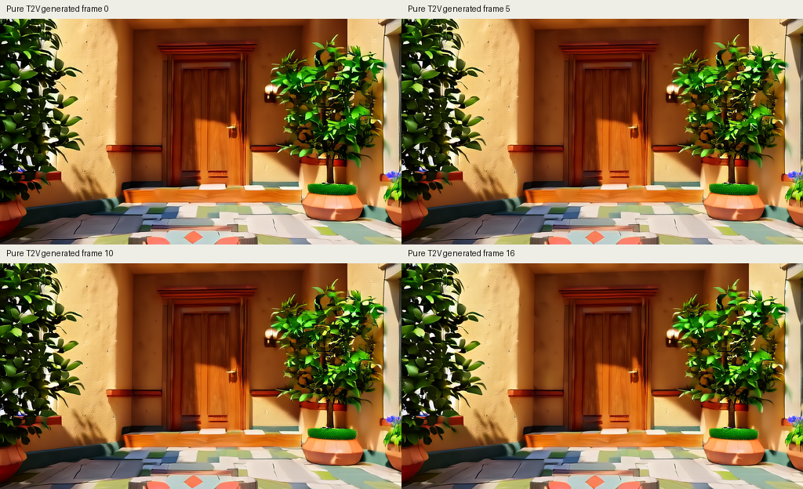
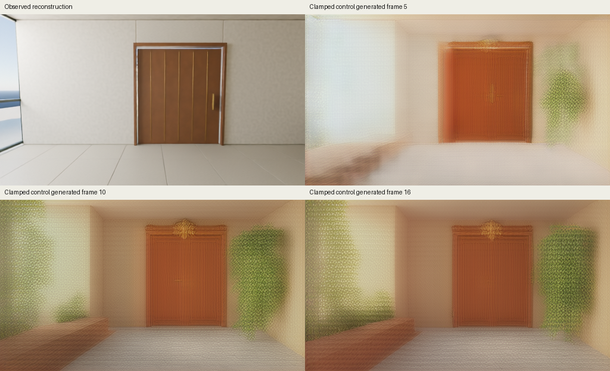

# Reduced-resolution native-style Wan control

The initial pure-T2V diagnostic restores the official T2V conditioning and UniPC recipe before any further action-adapter training. It uses the externally pretrained Wan model with no adapter, observed-image clamp, action input, capture-cache access or model training. It cannot establish Worldline control quality or Genie 3 parity.

The first runtime check is one negative/positive forward pair at 512 x 288 pixels and 17 decoded-frame equivalent. This size is smaller than the official 1.3B CLI's listed 480p dimensions and 81-frame example. The port uses float32 throughout, including parameters, attention, time projections, modulation, residuals and the head. It is an explicit full-precision numerical control. It does not claim bitwise reproduction of native CUDA BF16 autocast or FlashAttention.

## Official source and compatibility changes

[vendor/model.py](vendor/model.py), [vendor/fm_solvers_unipc.py](vendor/fm_solvers_unipc.py) and [vendor/attention.py](vendor/attention.py) are unchanged copies of official [Wan2.1 commit 9737cba9](https://github.com/Wan-Video/Wan2.1/tree/9737cba9c1c3c4d04b33fcad41c111989865d315), under the included Apache-2.0 license. [The manifest](vendor/source-manifest.json) records exact source hashes and URLs. Official T2V and shared-config references are retained as text files.

[portable.py](portable.py) loads the identical model source into separate reference and portable Python modules. The reference keeps the official CPU complex-double RoPE and double timestep calculation. Both modules substitute FP32 PyTorch SDPA for CUDA FlashAttention. The portable module additionally uses real-valued float32 RoPE and computes the small double-precision timestep table on CPU before transfer. It retains the official tanh-approximate text GELU, normalization layers, float32 paths and all network layers. No minWM network code or existing FP16 adapter port is imported.

The official pretrained transformer and config use [weight revision 37ec5126](https://huggingface.co/Wan-AI/Wan2.1-T2V-1.3B/tree/37ec512624d61f7aa208f7ea8140a131f93afc9a). Their bytes and SHA256 are checked before loading. Original float32 tensors load directly without quantization or conversion. Weights remain external and require an explicit separate download.

## Conditions and solver

The declared solver is the exact pinned `FlowUniPCMultistepScheduler`, constructed with shift 1, then configured for 50 steps and shift 8. It provides its own integer timesteps and float32 sigmas. Guidance is 6. Negative and positive passes run sequentially with identical Gaussian inputs and timestep. All latent frames start from noise, including frame zero. The CPU noise generator uses seed 20260908, with the actual noise saved; matching the seed alone does not imply CUDA RNG identity.

The positive text remains the genuine cached Atrium prompt from the failed adaptation. The negative text is the exact configured Chinese prompt from the pinned official shared config, encoded by the real UMT5 encoder. Both cache identities and text hashes are checked. The empty-string cache is not substituted.

## Numerical checks

[test_parity.py](test_parity.py) compares complete tiny random-weight CPU forwards at timesteps 999, 500 and 50. It checks text and time projections, two full transformer blocks, the output head and nonzero final velocities. It uses the real model's 128-feature head width and padded, unequal sequence lengths. Tolerance is 0.00002 absolute and relative. This is FP32 source/port parity with common SDPA, not a full pretrained CUDA-versus-MPS test.

[test_independent.py](test_independent.py) independently checks pinned source hashes, masked attention against explicit softmax, positional math including unequal head-width partitions, official UniPC equations/timesteps, sequential guidance, all 50 updates, 100 text-conditioned calls, absence of a first-frame clamp, finite guidance and stale-report rejection.

## Run the bounded profile

From `experiments/wan_adapter`, use the combined runtime dependencies and a completed genuine native text cache. Run outputs must be outside this `native_control` source tree. Each output path must be new.

```sh
python -m pip install -r requirements-real.txt
python native_control/test_parity.py --output results/native-parity.json
python native_control/test_independent.py --output results/native-independent.json
PYTORCH_ENABLE_MPS_FALLBACK=0 python native_control/profile_pair.py \
  --weights external-weights \
  --text-cache text_cache/native-results \
  --parity-report results/native-parity.json \
  --independent-report results/native-independent.json \
  --output results/native-pair-profile
```

The profiler refuses source-stale test reports. It snapshots the actual source and imported shared helpers, checks external checkpoint and cache hashes, loads the full float32 core, and runs one negative/positive pair. It saves initial noise and one guided velocity as runtime evidence. It performs no generation loop and does not decode that velocity as a video.

The watchdog allows at most 900 seconds, 18 GiB process/Metal allocation, and requires at least 2 GiB available system memory. RSS and Metal memory overlap and must not be added. A stopped attempt retains its watchdog record and supplies no generation-quality result. The reported 50-step estimate includes measured first-pair cost, measured validation/loading/hash overhead and explicit allowances for later decode/artifact work. Full generation requires a separate decision based on that measured estimate.

## Measured profile and reviewed single-clip runner

The [completed full-float32 profile](results/pair-fp32/metrics.json) loaded all 825 pretrained keys exactly. One sequential negative/positive pair took 13.732 seconds; the complete measured interval was 25.509 seconds. Sampled peak Metal driver allocation was 7.665 GiB, with 5.433 GiB in active Metal tensors. The profile's original inclusive 50-step estimate was 738.357 seconds. These numbers measure runtime, not generated-image quality.

The [first profile attempt](results/pair-transfer-failure/metrics.json) failed before completing a forward because a combined CPU-transfer/float64-cast operation attempted the unsupported cast on MPS first. The corrected operation transfers to CPU before casting. Both source versions and both attempts are retained. CPU forward parity after the correction had maximum absolute error 0.0000008345 across the checked intermediate and final outputs. A direct MPS timestep test matched CPU exactly.

A [tiny MPS scheduler check](results/checks/mps-scheduler-compatibility.json) found that PyTorch2.5.1 does not implement the linear solve required by the official UniPC corrector on MPS. [loop.py](loop.py) therefore keeps the unchanged official solver and its float32 state on CPU. It explicitly transfers the current latent to the FP32 MPS denoiser and transfers the guided velocity back. Automatic operator fallback remains disabled. The model-free [50-step transfer/solver measurement](results/solver-transfers/metrics.json) was exactly equal to its all-CPU reference and added 0.106 seconds of measured solver and transfer work. This test does not produce a video-quality result.

The [twelve independent CPU checks](results/checks/independent-tests-clip-review.json) include a changing-velocity oracle comparison of this device boundary with the original all-CPU sampling loop. They also reject invalid, stale and over-budget profiles before generation. The final gate replaces the earlier generic decoder allowance with the separately measured full-float32 VAE load and decode interval of 28.527 seconds. Together with the measured solver/transfer work, its inclusive estimate is 736.990 seconds under the unchanged 900-second limit.

After reviewing these measurements, the single-clip command is:

```sh
PYTORCH_ENABLE_MPS_FALLBACK=0 python native_control/profile_solver.py \
  --output results/native-solver-transfers
PYTORCH_ENABLE_MPS_FALLBACK=0 python native_control/run_clip.py \
  --weights external-weights \
  --text-cache text_cache/native-results \
  --profile-run results/native-pair-profile \
  --solver-profile results/native-solver-transfers/metrics.json \
  --output results/native-clip50
```

The runner saves the exact profiled initial noise before inference, uses no captured image or action data, executes exactly 50 UniPC updates and 100 sequential model calls, and saves every final frame. It releases the transformer before the official FP32 VAE decode. The decoder uses the independently validated allocator-only temporal cleanup hook. A 10fps GIF is preview playback; measured generation speed is reported separately. The measured source is copied before inference, and completed or stopped outputs are never overwritten.

## Completed clip on September 7, 2026



The inspected frames show a recognizable doorway, warm plaster walls and plants. The repeated surface lattice from the earlier adaptation is absent in frames 0, 5, 10 and 16. Colors are saturated, some textures appear stylized, and the composition changes little during the short clip. This is a working externally pretrained text-to-video path at the tested size. It does not demonstrate the original adapter's action control, persistent memory, or frontier visual quality. Because the control restores several settings together, it does not identify which single setting caused the improvement.

| Measurement | Completed control |
|---|---:|
| Full float32 core loading and verification | 7.817 s |
| 50 UniPC steps and 100 sequential model calls | 617.322 s |
| Official float32 VAE load | 0.884 s |
| Decode all 17 generated frames | 30.928 s |
| Measured validation/load/generation/artifact interval | 663.765 s |
| Peak sampled Metal driver allocation | 10.395 GiB |
| Peak sampled active Metal tensors | 6.631 GiB |
| Peak sampled process RSS | 0.479 GiB |
| Generated frames per second, denoising plus decode | 0.0262 |
| GIF preview playback | 10 fps |

All 17 frames are newly generated; no observed frame was inserted. The official base loaded all 825 keys exactly and remained frozen. All recorded latent states and decoded frames were finite. The run completed within the original 900-second guard. The measurement interval excludes interpreter/import startup. Memory measures overlap and are not additive.

The [full report](results/clip50/metrics.json), [preview](results/clip50/preview.gif), [all PNG frames](results/clip50/frames/), [initial noise](results/clip50/initial-noise.safetensors), [final latents](results/clip50/generated-latents.safetensors), [source snapshots](results/clip50/measured-source/) and [memory samples](results/clip50/memory.jsonl) are retained. The noise tensor SHA256 is `ce38d20bcf6ca132aeac8259e0f085fdfe80c64db7745df1c561b294dc201eeb`; it matches the profiled initial Gaussian tensor. The output is evidence for this one fixed-seed, reduced-resolution control, not a reproduction of the official CUDA 480p/81-frame example.

## Completed single-factor initial-image clamp



The [predeclared comparison](PROPOSED_CLAMP.md) has now completed once. It keeps the successful native-style T2V path fixed and adds only the independently encoded original first image, clamped before each denoiser call and after each solver update. No action tensor, adapter or future target is loaded. The saved Gaussian noise is byte-identical to the successful pure control.

The reconstructed starting image is clear. Future frames show repeated lattice-like surface texture, blur, doorway changes and invented objects. This implicates hard clean first-latent clamping for this tested T2V input and seed. It is a failed image-continuation result, not evidence that every I2V architecture fails. All 50 prefix checks are exactly 0.0; correct enforcement of the clamp did not yield correct future imagery.

The run took 660.295 seconds, with 613.639 seconds denoising and 30.875 seconds decoding. Peak sampled Metal driver allocation was 9.491 GiB. One reconstructed observed frame and 16 generated future frames are saved; measured future-frame throughput is 0.0248 fps, separate from the 10-fps preview. See [all evidence and source snapshots](results/clamp50/README.md).

Reproduction after the successful control and the five independent clamp checks:

```sh
python native_control/test_clamp_independent.py --output results/clamp-independent.json
PYTORCH_ENABLE_MPS_FALLBACK=0 python native_control/clamp_run.py \
  --weights external-weights \
  --text-cache text_cache/native-results \
  --profile-run results/native-pair-profile \
  --solver-profile results/native-solver-transfers/metrics.json \
  --control-run results/native-clip50 \
  --observation-cache data_cache \
  --output results/native-clamp50
```

The observed cache carries original first-image and official VAE hashes plus 11 passed causality checks. Each output directory must be new. This command performs one bounded 50-step diagnostic, with the same 900-second and memory guards.
